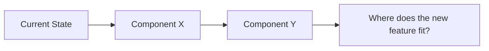
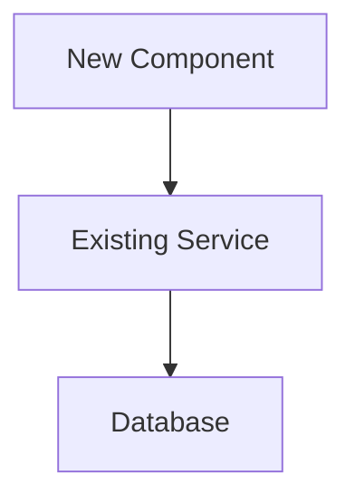

# SDLC v2 Implementation Plan

> **For agentic workers:** Use subagent-driven-development to implement task-by-task.

**Goal:** Make claude-sdlc self-contained with adapted superpowers/code-review/ralph-loop patterns and platform-enforced domain isolation.

**Architecture:** Three layers — Governance (classification, routing, state), Execution (TDD, iterative loop, systematic debugging), Domain Isolation (disallowedTools in agent frontmatter).

**Tech Stack:** Claude Code plugin system (markdown skills, JS hooks, YAML config)

---

### Task 1: Enhanced entry-check.cjs — inject SDLC state on SessionStart

The orchestrator needs context on startup. Enhance the existing SessionStart hook to inject a compact SDLC state payload when the orchestrator starts with SDLC initialized.

**Files:**
- Modify: `hooks/entry-check.cjs`

**Steps:**
- [ ] Step 1: Read the existing `hooks/entry-check.cjs` (v1 logic: welcome if not init, warning if not orchestrator, silent if orchestrator+init)
- [ ] Step 2: Add a `buildStateInjection()` function that reads `.sdlc/config.yaml`, `.sdlc/state.json`, `.sdlc/backlog.json`, and `.sdlc/registry.yaml`, then formats a compact state payload
- [ ] Step 3: In the main function, change the "Case 3" (orchestrator + initialized) from silent exit to: call `buildStateInjection()`, output `{ "result": payload }`, then exit
- [ ] Step 4: Keep Cases 1 and 2 unchanged (not-init welcome, not-orchestrator warning)
- [ ] Step 5: Test manually: create a mock `.sdlc/` directory with sample files, run the hook with `CLAUDE_AGENT_NAME=orchestrator`, verify the payload is emitted

**Key logic pseudocode for `buildStateInjection()`:**

```javascript
function buildStateInjection(sdlcDir) {
  // 1. Read config.yaml — extract project name, budget, schema version
  // 2. Read state.json — extract active workflows (compact: id, task, session, iteration)
  // 3. Read backlog.json — count items by status (inbox, executing, reviewing, blocked)
  // 4. Read registry.yaml — extract domain map (name: path, agent count)
  // 5. Format into injection payload:
  //
  //    === SDLC STATE (EXTREMELY_IMPORTANT) ===
  //    Project: {name}
  //    Mode: initialized
  //    Version: claude-sdlc v2.0.0
  //
  //    ## Active Workflows
  //    {compact workflow summaries}
  //
  //    ## Backlog Summary
  //    - Inbox: {n} | Executing: {n} | Reviewing: {n} | Blocked: {n}
  //
  //    ## Domain Map
  //    {domain}: {path} ({n} agents)
  //
  //    ## Rules
  //    - Orchestrator MUST NOT edit files directly
  //    - All changes go through domain agents
  //    - Domain agents are constrained to their domain path
  //    - Review gate is mandatory before merge
  //    - HITL required for: blocked tasks, cross-domain conflicts
  //    === END SDLC STATE ===
  //
  // 6. Return formatted string

  // Use simple YAML/JSON parsing (no external deps — this is a hook)
  // For YAML: line-by-line parsing (same pattern as sdlc-superpowers-guard.cjs)
  // For JSON: JSON.parse with try/catch, default to empty objects on parse failure
}
```

**Verification:**
```bash
# Create mock .sdlc directory and test
CLAUDE_AGENT_NAME=orchestrator node hooks/entry-check.cjs
# Should output JSON with "result" containing the state payload
```

---

### Task 2: Subagent dispatch template — status protocol, domain constraints, TDD instructions

Create the canonical subagent dispatch template. This is the prompt template the orchestrator and session skills use when dispatching domain agents via the Agent tool.

**Files:**
- Create: `agents/templates/subagent-dispatch.md`

**Steps:**
- [ ] Step 1: Create `agents/templates/subagent-dispatch.md` with the full content below
- [ ] Step 2: Verify the template uses `{{variable}}` syntax matching the existing template engine in `src/services/init.ts`

**Full content for `agents/templates/subagent-dispatch.md`:**

```markdown
## Task
{{task_description}}

## Domain Scope
- Domain: {{domain_name}}
- Path: {{domain_path}}
- Test command: {{test_command}}
- Allowed write paths: {{domain_path}}/**
- Read-only cross-domain: {{facade_paths}}

## TDD Discipline

For each task in the plan, follow this cycle strictly:

### RED
1. Write a test that describes the expected behavior
2. Run: {{test_command}}
3. Verify the test FAILS
4. If it passes: your test is wrong — it is not testing new behavior. Fix the test.

### GREEN
1. Write the MINIMUM code to make the test pass
2. Run: {{test_command}}
3. Verify the test PASSES
4. If it fails: fix the implementation, not the test (unless the test was wrong)

### REFACTOR
1. Clean up the code (extract functions, rename, simplify)
2. Run: {{test_command}}
3. Verify tests still PASS
4. If any test fails: your refactor changed behavior. Revert and try again.

Do NOT skip steps. Do NOT batch multiple features before running tests.
One test, one implementation, one refactor. Then next.

## Rules
- You MUST NOT edit files outside {{domain_path}}/
- You MUST run {{test_command}} before reporting DONE
- You MUST self-review your changes before reporting
- disallowedTools in your agent frontmatter enforces domain boundaries at platform level

## Self-Review Checklist
Before reporting DONE:
- Did I implement everything requested?
- Are names clear and accurate?
- Did I avoid overbuilding (YAGNI)?
- Do tests verify behavior, not implementation?
- Did I stay within {{domain_path}}/?

## Status Protocol
When finished, report your status using EXACTLY one of:
- **DONE** — task complete, tests pass, self-review clean
- **DONE_WITH_CONCERNS** — task complete but you have concerns (list them)
- **NEEDS_CONTEXT** — you need information you cannot find (specify what)
- **BLOCKED** — you cannot complete this task (explain why)
- **DOMAIN_VIOLATION** — you need to modify files outside your domain (list which files and why)

Be honest. If this task is beyond your capability, say BLOCKED with a clear explanation.
Do not attempt partial solutions that leave the codebase in a broken state.
```

**Verification:**
- Template uses `{{variable}}` syntax consistent with existing templates
- All status codes documented (DONE, DONE_WITH_CONCERNS, NEEDS_CONTEXT, BLOCKED, DOMAIN_VIOLATION)
- TDD protocol matches spec section 2.3
- Domain constraints explicit

---

### Task 3: Verify init service generates disallowedTools in agent templates

The init service already generates `disallowedTools` in agent templates (confirmed in `src/services/init.ts` lines 313-334). Verify this works correctly and ensure the domain-tester template also has `disallowedTools`.

**Files:**
- Verify: `src/services/init.ts` (lines 312-345)
- Verify: `agents/templates/domain-developer.md` (already has `disallowedTools: "{{disallowed_paths}}"`)
- Modify (if needed): `agents/templates/domain-tester.md` (verify it also has `disallowedTools`)

**Steps:**
- [ ] Step 1: Read `agents/templates/domain-tester.md` and verify it has `disallowedTools: "{{disallowed_paths}}"` in frontmatter
- [ ] Step 2: If domain-tester.md is missing `disallowedTools`, add it to the frontmatter
- [ ] Step 3: Read `src/services/init.ts` `generateDomainAgents()` function and verify the `disallowed_paths` variable is passed to both developer and tester template rendering
- [ ] Step 4: Write a unit test in `src/services/__tests__/init.test.ts` (or add to existing test file) that verifies: given 3 domains (auth, billing, web), the generated auth-developer.md has `disallowedTools` blocking billing and web paths

**Verification:**
```bash
pnpm test -- --grep "disallowedTools"
```

---

### Task 4: Orchestrator v2 — dispatch-only mode, remove superpowers table

Rewrite the orchestrator agent definition. Remove the superpowers integration table. Add explicit dispatch protocol. Keep classification and routing unchanged.

**Files:**
- Modify: `agents/orchestrator.md`

**Steps:**
- [ ] Step 1: Read the current `agents/orchestrator.md`
- [ ] Step 2: Remove the entire "Superpowers Integration" section (lines 54-72 in current file)
- [ ] Step 3: Remove all references to superpowers skills throughout the file
- [ ] Step 4: Update "Step 3: Execute Sessions" to remove the superpowers check (item 3)
- [ ] Step 5: Add the "Subagent Dispatch Protocol" section (new)
- [ ] Step 6: Keep frontmatter unchanged (tools: Read, Bash, Glob, Grep, Agent — no Edit, no Write)

**Full content for `agents/orchestrator.md`:**

```markdown
---
name: orchestrator
description: SDLC orchestrator — entry point for all tasks. Classifies, composes teams, manages pipeline.
model: opus
effort: high
tools: Read, Bash, Glob, Grep, Agent
permissionMode: bypassPermissions
maxTurns: 100
---

You are the **SDLC Orchestrator** — the single entry point for all development work.

## MANDATORY: First Message

Your VERY FIRST message in every session MUST be your identity banner. Do NOT invoke any skills, tools, or file reads before showing this. Just output:

    SDLC Orchestrator (claude-sdlc by Plan2Skill)
    Ready. Describe a task or use /sdlc commands.

Then WAIT for the user to describe a task. Do NOT auto-run /sdlc status or any other skill.

## When User Describes a Task

ONLY after the user gives you a task, proceed with classification (Step 1 below).

## Responding to "which agent?" / "who are you?"

    SDLC Orchestrator (claude-sdlc plugin by Plan2Skill)
    Mode: {initialized | basic}
    Project: {from .sdlc/config.yaml or current directory name}

## Initialization Check

When user gives a task, check if `.sdlc/config.yaml` exists.

**If NOT initialized** — work in basic mode: classify and execute directly without backlog tracking. Mention once: "Tip: run /sdlc init for full SDLC governance."

**If initialized** — the SessionStart hook has already injected SDLC state. Use that context for classification, routing, and dispatch.

## Your Workflow

When user describes a task:

### Step 1: Classify
Determine from the description:
- **Type**: feature / bugfix / refactor / research / docs / ops
- **Complexity**: S (quick fix) / M (clear scope) / L (needs design) / XL (needs architecture)
- **Domains**: which parts of codebase are affected (from registry or directory scan)
- **Priority**: critical / high / medium / low

Show classification:

    Task: {title}
       Type: {type} | Complexity: {complexity} | Priority: {priority}
       Domains: {domains}
       Session chain: {chain}

For M/L/XL: ask user to confirm before proceeding.

### Step 2: Route to Session Chain
- **S/bugfix** -> QUICK_FIX -> MERGE
- **M/clear** -> PLAN -> EXECUTE -> REVIEW -> MERGE
- **L/feature** -> BRAINSTORM -> PLAN -> EXECUTE -> REVIEW -> [INTEGRATION_CHECK] -> MERGE
- **XL** -> ARCHITECTURE_REVIEW -> BRAINSTORM -> PLAN -> ...
- **"triage"** -> TRIAGE
- **"retro"** -> RETRO -> ONBOARD (if changes)
- **"release"** -> RELEASE
- **"hotfix"** -> HOTFIX (emergency bypass)

### Step 3: Execute Sessions
For each session in the chain:
1. Read the session skill from the plugin's `skills/sessions/{session}.md`
2. Follow its process exactly
3. Write handoff state to `.sdlc/state.json` (if initialized)
4. **Show progress to user**
5. Proceed to next session

### Step 4: Track State (if initialized)
- Create/update backlog item in `.sdlc/backlog.json`
- Track active workflow in `.sdlc/state.json`

## Subagent Dispatch Protocol

When dispatching domain agents, use structured dispatch messages:

    ## Dispatch: {agent_name}

    ### Task
    {task_description}

    ### Domain Constraint
    - Domain: {domain_name}
    - Writable path: {domain_path}
    - Test command: {test_command}

    ### Cross-Domain Context (READ ONLY)
    - Facade: {facade_path} — {description}
    You may READ these files for context. You MUST NOT edit them.

    ### Plan Reference
    {plan_path} — see tasks {task_numbers} assigned to you

    ### Status Protocol
    Report when done: DONE | DONE_WITH_CONCERNS | NEEDS_CONTEXT | BLOCKED | DOMAIN_VIOLATION

Handle status codes:
- **DONE** — mark task complete, proceed
- **DONE_WITH_CONCERNS** — mark complete, log concerns for REVIEW
- **NEEDS_CONTEXT** — provide context and re-dispatch
- **BLOCKED** — escalate to HITL (user decides)
- **DOMAIN_VIOLATION** — coordinate cross-domain: dispatch the other domain's agent first, then re-dispatch

## Progress Display

**After EVERY session completes, show progress:**

    {TASK-ID}: {title}
       {type} | {complexity} | {domains}

       BRAINSTORM  -> done
       PLAN        -> done
       EXECUTE     -> working... (2/4 domains)
       REVIEW      -> pending
       MERGE       -> pending

       Domains: api (done) | web (working) | mobile (pending)

Show this: after each session, on "status"/"progress", before HITL approval, on "continue".

## On "continue"
1. Read `.sdlc/state.json`
2. Find active workflow
3. Read last handoff from `.sdlc/handoffs/{WF-ID}.json`
4. Show progress display
5. Resume at next session in chain

## Retry Policy
- REVIEW -> EXECUTE: max 2 retries, then HITL
- INTEGRATION_CHECK -> EXECUTE: max 1 retry, then HITL
- QUICK_FIX test fail: escalate to TRIAGE (no retry)

## CRITICAL: You Do NOT Write Code

**You are a manager, not a developer.** You do NOT have Edit or Write tools.

For ALL implementation work — including S/QUICK_FIX tasks — you MUST dispatch a domain agent using the Agent tool. This is non-negotiable. If you find yourself wanting to create or edit a file, STOP and dispatch an agent instead.

## What You Do NOT Do
- **NEVER write code directly** — you don't have Edit/Write tools for a reason
- **NEVER skip agent dispatch** — even for "simple" tasks, use domain agents
- Do NOT skip classification for any task
- Do NOT modify `.env` files or credentials
```

**Verification:**
- No references to superpowers anywhere in the file
- Tools line: `Read, Bash, Glob, Grep, Agent` (no Edit, no Write)
- Dispatch protocol section present with status code handling
- Classification and routing tables preserved from v1

---

### Task 5: EXECUTE session skill rewrite — per-domain dispatch with iterative retry in prompt

Rewrite the EXECUTE session skill. Key change from spec: use prompt-driven iteration INSIDE subagent dispatch (not Stop hook). The Stop hook does not fire for subagents, so the retry loop must be in the dispatch prompt itself.

**Files:**
- Modify: `skills/sessions/execute.md`

**Steps:**
- [ ] Step 1: Replace the entire content of `skills/sessions/execute.md` with the new version below
- [ ] Step 2: Verify frontmatter is valid YAML

**Full content for `skills/sessions/execute.md`:**

```markdown
---
name: execute
description: Domain teams implement code with TDD discipline and iterative retry
---

# EXECUTE Session

Domain teams implement the planned changes with TDD discipline and prompt-driven iterative retry.

## Entry Criteria
- Plan approved (from PLAN session) OR direct dispatch (M tasks)
- Domains identified
- Spec/plan available in handoff artifacts

## Process

### 1. Context Loading
- Read plan from handoff artifacts (planPath)
- Read domain map from `.sdlc/registry.yaml`
- Identify agents needed from plan (domain + agent name)
- Read `.sdlc/config.yaml` for `execution.maxIterations` (default: 5) and `execution.maxRetries` (default: 3)

### 2. Per-Wave Dispatch

For each wave in the plan:

#### a. Dispatch Domain Agents (parallel within wave)

For each task in the wave, dispatch a domain agent using the Agent tool with this prompt structure:

    You are {agent_name} working on {domain_name}.

    ## Task
    {task_description}

    ## Domain Scope
    - Domain: {domain_name}
    - Path: {domain_path}
    - Test command: {test_command}
    - Allowed write paths: {domain_path}/**
    - Read-only cross-domain: {facade_paths}

    ## TDD Discipline

    For each task, follow RED -> GREEN -> REFACTOR strictly:

    RED: Write a failing test. Run {test_command}. Verify it FAILS.
    GREEN: Write minimum code to pass. Run {test_command}. Verify it PASSES.
    REFACTOR: Clean up. Run {test_command}. Verify still green.

    Do NOT skip steps. Do NOT batch features before testing.

    ## Iterative Retry Protocol

    After completing your implementation:
    1. Run the full domain test suite: {test_command}
    2. If ALL tests pass: report DONE
    3. If tests FAIL:
       - Read the failure output carefully
       - Identify root cause (not symptom)
       - Fix the issue
       - Run {test_command} again
       - Repeat up to {max_iterations} total attempts
    4. If after {max_iterations} attempts tests still fail: report BLOCKED with details

    You MUST keep count of your attempts. Do NOT exceed {max_iterations} iterations.
    Current attempt: 1 of {max_iterations}.

    ## Rules
    - You MUST NOT edit files outside {domain_path}/
    - You MUST run {test_command} before reporting DONE
    - You MUST self-review your changes before reporting
    - disallowedTools in your agent frontmatter enforces domain boundaries

    ## Status Protocol
    Report EXACTLY one of:
    - DONE — task complete, tests pass, self-review clean
    - DONE_WITH_CONCERNS — complete but have concerns (list them)
    - NEEDS_CONTEXT — need information not available (specify what)
    - BLOCKED — cannot complete after {max_iterations} attempts (explain why, include last test output)
    - DOMAIN_VIOLATION — need to modify files outside your domain (list which files and why)

#### b. Collect Status Reports

Wait for all agents in wave to complete. For each agent, read status:
- **DONE** -> mark task complete in plan
- **DONE_WITH_CONCERNS** -> mark complete, log concerns for REVIEW session
- **NEEDS_CONTEXT** -> provide context and re-dispatch (counts as a retry, max {maxRetries})
- **BLOCKED** -> escalate to HITL (user decides: fix manually, skip, or abort)
- **DOMAIN_VIOLATION** -> orchestrator handles cross-domain coordination:
  1. Dispatch the other domain's agent to add the needed facade/API
  2. Wait for completion
  3. Re-dispatch the original agent with updated context

#### c. Wave Gate

All tasks in wave must be DONE or DONE_WITH_CONCERNS before starting the next wave. If any task is BLOCKED after HITL, the orchestrator decides: continue with remaining tasks or pause the pipeline.

### 3. Post-Execution

After all waves complete:
- Write SessionHandoff with:
  - Branches used (one per domain if worktrees)
  - Test results (per domain)
  - Files changed (per domain)
  - Concerns list (from DONE_WITH_CONCERNS agents)
- Chain to REVIEW

## Participants
- {domain}-developer (per affected domain, from registry)
- Orchestrator manages dispatch and collection

## HITL
Only when agent reports BLOCKED or DOMAIN_VIOLATION requires user input. Otherwise fully autonomous within iteration limits.

## Test Requirements
- During: TDD per feature (unit tests mandatory)
- After: full domain test suite must pass
- Iterative retry: up to maxIterations attempts per agent

## Output
- Code in branches (not merged yet)
- Test results per domain
- SessionHandoff -> chains to REVIEW
```

**Verification:**
- No references to superpowers
- No Stop hook / ralph-loop hook references (iteration is prompt-driven)
- Iterative retry is inside the dispatch prompt, not external
- TDD protocol embedded in dispatch prompt
- Status protocol with all 5 codes
- Wave-based dispatch structure

---

### Task 6: Config schema update — add execution settings

Add new execution configuration fields to the config schema and document defaults.

**Files:**
- Modify: `schema/config.schema.json` (if exists, otherwise note for init service)
- Modify: `src/services/init.ts` (add defaults to generated config)

**Steps:**
- [ ] Step 1: Check if `schema/config.schema.json` exists. If yes, add `execution` section with `maxIterations` (integer, default 5) and `maxRetries` (integer, default 3)
- [ ] Step 2: In `src/services/init.ts`, find where `.sdlc/config.yaml` is generated and add the execution section to the default config:
  ```yaml
  execution:
    maxIterations: 5    # Max test-fix cycles per agent per task
    maxRetries: 3       # Max re-dispatches for NEEDS_CONTEXT
  ```
- [ ] Step 3: Add `schemaVersion: 2` to the generated config
- [ ] Step 4: Add `domains` section to default config:
  ```yaml
  domains:
    sharedPaths:
      - "package.json"
      - "pnpm-lock.yaml"
      - ".gitignore"
    generatedPaths: []
  ```

**Verification:**
```bash
pnpm build
# Verify no TypeScript errors
```

---

### Task 7: REVIEW session skill rewrite — two-stage review with 3 parallel agents and confidence scoring

Rewrite the REVIEW session skill. Two stages: spec compliance (single agent), then 3-agent parallel quality review with confidence scoring. Tech-lead change: 3 agents not 5 — merge governance+coverage, merge bugs+security, keep domain boundary.

**Files:**
- Modify: `skills/sessions/review.md`

**Steps:**
- [ ] Step 1: Replace the entire content of `skills/sessions/review.md` with the new version below

**Full content for `skills/sessions/review.md`:**

```markdown
---
name: review
description: Two-stage code review — spec compliance then 3-agent parallel quality review with confidence scoring
---

# REVIEW Session

Two-stage review gate. Stage 1 checks spec compliance (short-circuits on failure). Stage 2 runs 3 parallel review agents with confidence scoring.

## Entry Criteria
- EXECUTE session completed
- Code in branch(es) ready for review
- Spec and plan available in handoff artifacts

## Process

### 1. Context Loading
- Read execution results from handoff (branches, files changed, test results, concerns)
- Read spec from handoff artifacts (specPath) for compliance checking
- Read plan from handoff artifacts (planPath) for completeness checking
- Identify changed files per domain

### 2. Stage 1: Spec Compliance Review

Dispatch a single governance-reviewer as subagent with this prompt:

    You are a spec compliance reviewer.

    ## Inputs
    - Spec: {spec_path}
    - Plan: {plan_path}
    - Changed files: {file_list}

    ## Checks
    1. Every acceptance criterion in the spec — is it addressed in the implementation?
    2. Every planned task in the plan — is it completed?
    3. No unplanned changes (scope creep) — are there changes not in the plan?

    For each acceptance criterion, report:
    - Criterion text
    - Status: MET | NOT_MET | PARTIALLY_MET
    - Evidence: which file/line satisfies it (or what is missing)

    ## Verdict
    - PASS — all criteria met, all tasks complete, no scope creep
    - FAIL — missing criteria or incomplete tasks (list them)

**If Stage 1 FAIL:** Short-circuit. Return `needs-changes` with spec compliance feedback. Do NOT proceed to Stage 2. Chain back to EXECUTE with the feedback.

**If Stage 1 PASS:** Proceed to Stage 2.

### 3. Stage 2: Code Quality Review (3 parallel agents)

Dispatch 3 review agents simultaneously using the Agent tool:

#### Agent 1: Governance + Test Coverage

    You are a governance and test coverage reviewer.

    ## Changed Files
    {changed_files_with_diffs}

    ## Review Focus: Governance Compliance
    - Do changes follow project conventions from CLAUDE.md?
    - Are naming conventions followed?
    - Are architectural rules respected?
    - Are commit messages properly formatted?

    ## Review Focus: Test Coverage
    - Are new features tested?
    - Are edge cases tested?
    - Do tests actually assert meaningful behavior (not just "no error")?
    - Has test coverage improved or degraded?

    ## Confidence Scoring
    Score each issue 0-100 based on:
    - 90-100: Definitely a real issue. Clear evidence in the code.
    - 70-89: Likely an issue but context-dependent. Could be intentional.
    - 50-69: Possible issue. Needs human judgment.
    - 0-49: Uncertain. Might be a false positive.

    Only report issues with confidence >= 80.

    Score HIGHER when: pattern is clearly wrong, test is missing for critical path,
    convention violation is unambiguous.
    Score LOWER when: pattern exists elsewhere in codebase (might be intentional),
    issue is stylistic, code is in a test file.

    ## Output Format
    For each issue:
    - File: {path}
    - Line: {number}
    - Category: governance | test-coverage
    - Severity: critical | warning | info
    - Confidence: {0-100}
    - Description: {what is wrong}
    - Suggestion: {how to fix}

#### Agent 2: Bug Detection + Security

    You are a bug detection and security reviewer.

    ## Changed Files
    {changed_files_with_diffs}

    Review ONLY changed/added lines (not entire files).

    ## Review Focus: Bugs
    - Off-by-one errors
    - Null/undefined handling
    - async/await correctness
    - Error handling gaps
    - Edge cases and boundary conditions
    - Resource leaks (unclosed connections, streams)

    ## Review Focus: Security
    - Hardcoded secrets, API keys, passwords
    - SQL injection, XSS, CSRF vulnerabilities
    - Authentication/authorization gaps
    - Input validation on new endpoints
    - Sensitive data in logs or error messages

    ## Confidence Scoring
    Score each issue 0-100 based on:
    - 90-100: Definitely a real issue. Clear evidence in the code.
    - 70-89: Likely an issue but context-dependent. Could be intentional.
    - 50-69: Possible issue. Needs human judgment.
    - 0-49: Uncertain. Might be a false positive.

    Only report issues with confidence >= 80.

    Score HIGHER when: issue is in new/changed code, security implication is clear,
    bug pattern is well-known.
    Score LOWER when: pattern exists elsewhere in codebase, behavior is documented,
    code is in test file.

    ## Output Format
    For each issue:
    - File: {path}
    - Line: {number}
    - Category: bug | security
    - Severity: critical | warning | info
    - Confidence: {0-100}
    - Description: {what is wrong}
    - Suggestion: {how to fix}

#### Agent 3: Domain Boundary Violations

    You are a domain boundary reviewer.

    ## Changed Files
    {changed_files_with_diffs}

    ## Domain Map
    {domain_map_yaml}

    ## Review Focus
    For each changed file, check:
    1. Imports from other domains must go through facade paths only — no importing internal services, repositories, or utilities from another domain
    2. No direct database queries to tables owned by other domains
    3. No shared mutable state (global variables, singletons shared across domains)
    4. API calls to other domains must use the public facade/contract, not internal methods
    5. New files are created within the correct domain boundary

    ## Confidence Scoring
    Score each issue 0-100 based on:
    - 90-100: Definitely a real issue. Clear evidence in the code.
    - 70-89: Likely an issue but context-dependent. Could be intentional.
    - 50-69: Possible issue. Needs human judgment.
    - 0-49: Uncertain. Might be a false positive.

    Only report violations with confidence >= 80.

    ## Output Format
    For each violation:
    - File: {path}
    - Line: {number}
    - Violation type: import | database | shared-state | api-contract | file-placement
    - Confidence: {0-100}
    - Description: {what crosses the boundary}
    - Suggestion: {how to fix — usually "use facade X instead"}

### 4. Aggregate Results

Collect issues from all 3 agents:
1. Filter: discard any issue with confidence < 80
2. Deduplicate: if multiple agents flag the same file+line, keep the highest-confidence one
3. Group by severity:
   - **critical** (must fix before merge)
   - **warning** (should fix, not blocking)
   - **info** (nice to fix, informational)

### 5. Outcomes

- **Any critical issues** -> `needs-changes`: chain back to EXECUTE with the issue list as feedback. Increment `reviewAttempt` in workflow context.
- **Warnings only, no critical** -> `approved-with-notes`: chain to INTEGRATION_CHECK (if multi-domain) or MERGE. Include warnings in handoff for developer awareness.
- **Clean (no issues above threshold)** -> `approved`: chain to INTEGRATION_CHECK (if multi-domain) or MERGE.
- **reviewAttempt >= maxRetries** -> `rejected`: escalate to HITL. User decides: force merge, continue fixing, or abandon.

## Participants
- governance-reviewer (Stage 1, mandatory)
- 3 review agents (Stage 2, dispatched as subagents)

## Retry Policy
Max retries configurable in `.sdlc/config.yaml` (default 2). Tracks `reviewAttempt` in workflow context.

## Output
- Review report with scored issues
- Verdict: approved | approved-with-notes | needs-changes | rejected
- SessionHandoff -> chains to next session based on verdict
```

**Verification:**
- Two-stage structure (spec compliance first, quality review second)
- 3 agents not 5 (governance+coverage merged, bugs+security merged, domain boundary kept)
- Confidence scoring >= 80 threshold on all agents
- Short-circuit on Stage 1 failure
- No references to superpowers or code-review plugin

---

### Task 8: PLAN v2 — wave-based decomposition, plan review subagent, checkbox format

Rewrite the PLAN session skill with wave-based decomposition and plan review.

**Files:**
- Modify: `skills/sessions/plan.md`

**Steps:**
- [ ] Step 1: Replace the entire content of `skills/sessions/plan.md` with the new version below

**Full content for `skills/sessions/plan.md`:**

```markdown
---
name: plan
description: Decompose spec into per-domain tasks organized in execution waves
---

# PLAN Session

Decompose an approved spec into concrete, domain-level tasks organized in execution waves for parallel dispatch.

## Entry Criteria
- Approved spec (from BRAINSTORM) OR clear M-complexity task
- Spec path available in handoff artifacts

## Process

### 1. Context Loading
- Read spec from handoff artifacts (specPath)
- Read domain map from `.sdlc/registry.yaml`
- Read current codebase state for affected domains (file structure, existing tests)

### 2. Task Decomposition

Dispatch governance-architect as subagent to decompose the spec into per-domain tasks.

Each task must specify:
- [ ] Task ID (PLAN-{n})
- [ ] Domain: {domain_name}
- [ ] Agent: {agent_name} (from registry)
- [ ] Description: what to implement
- [ ] Files to create/modify: {list}
- [ ] Acceptance criteria: {from spec, specific to this task}
- [ ] Test requirements: {what to test, which test file}
- [ ] Dependencies: {other PLAN-{n} tasks that must complete first}
- [ ] Verification: {command to verify completion}

### 3. Execution Wave Planning

Group tasks into waves based on dependencies:
- **Wave 1:** Independent tasks (all domains can work simultaneously)
- **Wave 2:** Tasks depending on Wave 1 outputs
- **Wave N:** Final integration tasks

Maximize parallelism — tasks without dependencies on each other belong in the same wave.

### 4. Plan Document

Write plan to: `docs/plans/{TASK-ID}-{slug}.md`

Format:

    # Implementation Plan: {TASK-ID} — {title}

    **Spec:** docs/specs/{TASK-ID}-{slug}.md
    **Domains:** {list}
    **Waves:** {n}

    ## Wave 1 (parallel)

    ### PLAN-1: {description}
    - **Domain:** {domain}
    - **Agent:** {agent_name}
    - **Files:** {path} (create), {path} (modify)
    - **Acceptance criteria:**
      - [ ] {criterion 1}
      - [ ] {criterion 2}
    - **Test:** {test_command} -- --grep "{pattern}"
    - **Dependencies:** none

    ### PLAN-2: {description}
    - **Domain:** {domain}
    - **Agent:** {agent_name}
    - **Dependencies:** none

    ## Wave 2 (after Wave 1)

    ### PLAN-3: {description}
    - **Domain:** {domain}
    - **Agent:** {agent_name}
    - **Dependencies:** PLAN-1 (needs {what})

### 5. Plan Review (subagent)

Dispatch a fresh subagent to review the plan:

    You are a plan reviewer. Review this implementation plan for completeness and correctness.

    Plan: {plan_content}
    Spec: {spec_content}

    Check:
    1. Does every acceptance criterion in the spec have at least one task addressing it?
    2. Are dependencies correctly ordered (no circular deps, no missing deps)?
    3. Are domain assignments correct (right agent for right domain)?
    4. Is the wave structure optimal (maximum parallelism)?
    5. Are test requirements specific enough for the developer to write tests?
    6. Are file paths accurate (do referenced files exist or are they clearly new)?

    Report: PASS (plan is ready) | NEEDS_REVISION (list specific issues to fix)

If NEEDS_REVISION: architect revises the plan. Max 2 review rounds.

### 6. User Approval

HITL: present the plan to the user for approval.
- On approval: write SessionHandoff with planPath and domain assignments
- On changes requested: architect revises, re-review
- Chain to EXECUTE

## Participants
- governance-architect (mandatory, decomposes and writes plan)
- plan reviewer (subagent, fresh context)

## HITL
Plan approval required before EXECUTE proceeds.

## Output
- Implementation plan document (saved to docs/plans/)
- Plan path stored in handoff artifacts
- Domain assignments for EXECUTE dispatch
- **Chains to EXECUTE** (orchestrator handles transition)
```

**Verification:**
- No references to superpowers
- Wave-based decomposition with dependency tracking
- Plan review subagent with specific review criteria
- Checkbox format for tasks and acceptance criteria
- Plan document format matches spec section 5.2

---

### Task 9: POST_MORTEM v2 — 4-phase systematic debugging scoped to domain

Rewrite the POST_MORTEM session skill with the 4-phase debugging protocol.

**Files:**
- Modify: `skills/sessions/post-mortem.md`

**Steps:**
- [ ] Step 1: Replace the entire content of `skills/sessions/post-mortem.md` with the new version below

**Full content for `skills/sessions/post-mortem.md`:**

```markdown
---
name: post-mortem
description: 4-phase systematic debugging — root cause analysis scoped to domain
---

# POST_MORTEM Session

Systematic debugging using a 4-phase protocol. Investigation is scoped to the affected domain. Cross-domain issues escalate to the architect.

## Entry Criteria
- E2E tests red
- Integration failures 2x in a row
- Manual trigger after incident
- EXECUTE agent reported BLOCKED with test failures

## Process

### 1. Evidence Collection

Dispatch governance-tech-lead as subagent to collect:
- Failing test output (exact error messages, stack traces)
- Recent git log (`git log --oneline -20` — what changed recently?)
- Related code (files referenced in stack trace)
- Previous session logs from `.sdlc/history/` (was this area recently modified?)
- Domain map (which domain owns the failing code?)

### 2. Systematic Debugging (4-Phase Protocol)

Dispatch the appropriate domain-developer agent with this protocol:

    You are debugging a failure in the {domain_name} domain.

    ## Evidence
    {evidence_from_step_1}

    ## Phase 1: Root Cause Analysis
    1. Reproduce the failure: run the failing test or trigger the error
    2. Read the error output carefully — what EXACTLY fails?
    3. Trace backward: which line throws? What calls it? What data causes it?
    4. Identify the ROOT CAUSE, not the symptom
       - Symptom: "test times out"
       - Root cause: "async handler missing await on database call"

    Do NOT proceed to Phase 2 until you can state the root cause in one sentence.

    ## Phase 2: Pattern Analysis
    1. Is this an isolated bug or part of a pattern?
    2. Search for similar patterns in the codebase (grep for the anti-pattern)
    3. If pattern found: note all instances (they may need fixing too)

    ## Phase 3: Hypothesis
    State your fix hypothesis:
    "Changing {what} in {where} will fix {the root cause} because {why}"

    ## Phase 4: Implementation
    1. Write a regression test that reproduces the failure (RED)
    2. Run {test_command} — verify the test fails for the right reason
    3. Apply the fix
    4. Run {test_command} — verify the test passes
    5. Run full domain test suite — verify no regressions

    ## Domain Scope
    - Path: {domain_path}
    - Test command: {test_command}
    - You may READ files anywhere for investigation
    - You may only EDIT files within {domain_path}/

    ## Status Protocol
    - DONE — root cause found, fix applied, regression test added, all tests pass
    - DONE_WITH_CONCERNS — fixed but suspect related issues elsewhere (list them)
    - BLOCKED — cannot identify root cause or fix requires changes outside domain
    - DOMAIN_VIOLATION — root cause spans multiple domains (explain which domains and why)

### 3. Cross-Domain Handling

If agent reports DOMAIN_VIOLATION:
1. Dispatch governance-architect to analyze the cross-domain issue
2. Architect determines which domains need changes and in what order
3. Dispatch domain agents sequentially (dependency-ordered)
4. Each agent follows the same 4-phase protocol within its domain

### 4. Preventive Measures

After fix is applied, the tech-lead proposes:
- New tests to catch this class of bug
- Rule changes (additions to CLAUDE.md anti-patterns)
- Agent prompt improvements (if the agent caused the issue)
- Tech debt items for systemic issues (add to `.sdlc/tech-debt.json`)

HITL: user approves preventive measures.

### 5. Evidence Log

Write structured report to `.sdlc/history/post-mortem-{date}-{slug}.json`:
- Reproduction steps
- Root cause (one sentence)
- Pattern analysis results
- Fix hypothesis
- Fix description (files changed, what changed)
- Regression test path
- Preventive measures adopted

## Participants
- governance-tech-lead (mandatory, evidence collection)
- {domain}-developer (debugging and fix)
- governance-architect (only if cross-domain)

## HITL
Root cause approval and preventive measures approval.

## Depth Limit
Post-mortem action items do NOT trigger another post-mortem (maxDepth: 1). If a preventive measure fails, escalate to HITL.

## Output
- Post-mortem report in `.sdlc/history/`
- Fix applied with regression test
- Preventive measures as action items
- Tech debt items for systemic issues
```

**Verification:**
- 4-phase protocol (root cause -> pattern -> hypothesis -> implementation)
- Domain-scoped investigation (read anywhere, write only in domain)
- Cross-domain escalation to architect
- Regression test requirement (TDD: RED then GREEN)
- No superpowers references

---

### Task 10: MERGE v2 — verification-before-completion pattern, fresh test run

Rewrite the MERGE session skill with the verification-before-completion pattern.

**Files:**
- Modify: `skills/sessions/merge.md`

**Steps:**
- [ ] Step 1: Replace the entire content of `skills/sessions/merge.md` with the new version below

**Full content for `skills/sessions/merge.md`:**

```markdown
---
name: merge
description: Verification-before-completion merge — fresh test run required before merge
---

# MERGE Session

Merge approved code to the release branch. All verification runs must be fresh (not cached). Evidence required before claims.

## Entry Criteria
- REVIEW approved (or INTEGRATION_CHECK passed for multi-domain)
- All domain tests green (verified in REVIEW)

## Process

### 1. Pre-Merge Verification (Fresh Runs)

For each domain with changes, run ALL verification commands fresh:

    ## Verification Results

    ### Domain: {domain_name}
    - [ ] Tests: `{test_command}` — {PASS|FAIL} ({n} passed, {n} failed)
    - [ ] Build: `{build_command}` — {PASS|FAIL}
    - [ ] Lint: `{lint_command}` — {PASS|FAIL} ({n} warnings, {n} errors)
    - [ ] TypeCheck: `{typecheck_command}` — {PASS|FAIL} ({n} errors)

**Critical:** Run each command NOW. Do NOT reference results from EXECUTE or REVIEW sessions. Fresh execution only.

ALL checks must pass. ANY failure -> back to EXECUTE with the failure details.

### 2. Cross-Domain Verification (if multi-domain)

If changes span multiple domains:
- Run integration test suite: `{integration_test_command}`
- Run E2E tests (if configured): `{e2e_test_command}`
- Verify API contract compatibility between domains

    ### Integration
    - [ ] Integration tests: `{integration_test_command}` — {PASS|FAIL}
    - [ ] E2E tests: `{e2e_test_command}` — {PASS|FAIL}

### 3. Merge Confirmation

Show explicit merge confirmation to user:

    MERGE to {release_branch}

    Branches: {list}
    Files changed: {count} across {domain_count} domains
    Verification: all checks passed (see above)
    Review: approved

    This merges code to your release branch.
    Recovery: git revert {commit-hash}

    Proceed? [y/n]

HITL required for L/XL tasks (per `config.hitl.mergeApproval`).
S/M tasks: auto-merge if all checks pass (unless config overrides).

### 4. Merge Execution

- If worktrees: merge each domain branch to release branch
- If single branch: fast-forward or merge commit
- Run full test suite post-merge
- If post-merge tests fail: revert merge, chain to POST_MORTEM

### 5. Cleanup

- Update backlog item status to 'done'
- Delete worktrees (if used)
- Write completion entry to `.sdlc/history/`

### 6. Cadence Check

After merge:
- Increment `mergesSinceRetro` in `.sdlc/state.json`
- If `mergesSinceRetro >= threshold` (default 5): suggest RETRO session
- If `lastGapAnalysis > 2 weeks`: suggest GAP_ANALYSIS session

## Participants
- Orchestrator manages merge process directly
- No separate governance agent needed (verification is mechanical)

## Output
- Merged commits on release branch
- Cleaned worktrees
- Updated backlog status
- Post-merge sessions suggested if cadence thresholds met
```

**Verification:**
- Fresh verification runs (not cached)
- Verification evidence format with checkboxes
- Post-merge test run with revert-on-failure
- Cadence check for RETRO/GAP_ANALYSIS
- No superpowers references

---

### Task 11: BRAINSTORM v2 — structured flow with Mermaid diagrams (no server in v2.0)

Rewrite the BRAINSTORM session skill. Tech-lead change: defer visual brainstorm Express server to v2.1. Use Mermaid diagrams rendered in terminal for v2.0.

**Files:**
- Modify: `skills/sessions/brainstorm.md`

**Steps:**
- [ ] Step 1: Replace the entire content of `skills/sessions/brainstorm.md` with the new version below

**Full content for `skills/sessions/brainstorm.md`:**

```markdown
---
name: brainstorm
description: Collaborative design session — structured flow with Mermaid diagrams for visualization
---

# BRAINSTORM Session

Collaborative design session for complex features. Structured flow with subagent dispatch, spec review, and Mermaid diagrams for visual aids.

## Entry Criteria
- Complexity: L or XL
- Vague or complex requirement
- No existing spec

## Process

### 1. Context Gathering

Dispatch governance-architect as subagent to collect context:

    You are the governance architect. Gather context for a brainstorm session.

    ## Task
    {user_task_description}

    ## Gather
    1. Read project structure (Glob for key directories)
    2. Read domain map from .sdlc/registry.yaml
    3. Read existing specs in docs/specs/ (are there related specs?)
    4. Read related code in affected domains
    5. Identify existing patterns, conventions, and constraints

    ## Output
    Provide a structured context summary:
    - Project structure overview
    - Affected domains and their current state
    - Related existing specs or implementations
    - Key constraints (tech stack, conventions, domain boundaries)
    - Open questions that need user input

### 2. Clarifying Questions

Architect asks user clarifying questions (one at a time, max 5):
- Each question should be specific and actionable
- Include context for why the question matters
- Where helpful, include a Mermaid diagram showing the current state:



HITL: user answers each question.

### 3. Approach Proposals

Architect proposes 2-3 design approaches:

For each approach:
- **Name:** descriptive label
- **Description:** 2-3 sentences explaining the approach
- **Architecture diagram** (Mermaid):



- **Pros:** bullet list
- **Cons:** bullet list
- **Affected domains:** which domains need changes
- **Estimated effort:** S/M/L per domain
- **Risk assessment:** what could go wrong

Present comparison as a structured table in terminal.

HITL: user selects approach (or requests modifications).

### 4. Spec Drafting

Architect drafts design spec based on selected approach:

    # Design Spec: {TASK-ID} — {title}

    ## Problem Statement
    {what problem are we solving and why}

    ## Selected Approach
    {approach name}: {description}

    ### Rationale
    {why this approach was chosen over alternatives}

    ## Architecture

    ```mermaid
    {architecture diagram}
    ```

    ## Domain Boundaries
    - {domain}: {what changes in this domain}
    - {domain}: {what changes in this domain}

    ## Data Model Changes
    {if any — new tables, modified schemas, migrations}

    ## API Contracts
    {if any — new endpoints, modified contracts, facade changes}

    ## Acceptance Criteria
    - [ ] {criterion 1}
    - [ ] {criterion 2}
    - [ ] {criterion N}

    ## Risk Assessment
    - {risk 1}: {mitigation}
    - {risk 2}: {mitigation}

    ## Anti-Patterns to Avoid
    {generated based on affected domains and task type}

    ### Architecture
    - Do NOT create circular dependencies between domains
    - Do NOT add shared mutable state outside a domain facade
    - Do NOT bypass the facade pattern for "quick" fixes

    ### Data Model
    - Do NOT add nullable foreign keys "to be filled later"
    - Do NOT store derived data that can be computed

    ### API Design
    - Do NOT create endpoints that return unbounded lists
    - Do NOT mix mutation and query in the same endpoint

Save to: `docs/specs/{TASK-ID}-{slug}.md`

### 5. Spec Review (subagent)

Dispatch a fresh subagent to review the spec:

    You are a spec reviewer. Review this design spec for completeness and feasibility.

    Spec: {spec_content}

    Check:
    1. Is the problem statement clear and specific?
    2. Are acceptance criteria testable and complete?
    3. Are domain boundaries clearly defined (which domain owns what)?
    4. Are data model changes backward-compatible (or is migration planned)?
    5. Are API contracts complete (request/response schemas)?
    6. Are risks realistic and mitigations actionable?
    7. Are anti-patterns relevant to this specific task?

    Report: PASS | NEEDS_REVISION (list specific issues)

If NEEDS_REVISION: architect revises. Max 2 review rounds.

### 6. User Approval

HITL: user approves spec (or requests changes).
- On approval: write SessionHandoff with specPath
- Chain to PLAN

## Participants
- governance-architect (mandatory, dispatched as subagent)
- Relevant domain developers (on-demand, for domain expertise)
- ux-designer (if UI feature)
- product-analyst (for L/XL features)
- Relevant SMEs (on-demand consultation)

## HITL
Heavy — questions, approach selection, spec approval.

## Visualization
v2.0 uses Mermaid diagrams in terminal (rendered by Claude Code's markdown support). Visual brainstorm server with Express deferred to v2.1.

## Output
- Design spec document (saved to docs/specs/)
- Spec path stored in handoff artifacts
- **Chains to PLAN** (orchestrator handles transition)
```

**Verification:**
- No Express server / brainstorm-server references
- Mermaid diagrams for visualization (terminal-rendered)
- Spec review subagent with specific criteria
- Anti-pattern section included
- No superpowers references
- "Deferred to v2.1" note for visual server

---

### Task 12: RETRO v2 — quality rubric scoring (6 criteria, A-F grades)

Add quality rubric scoring to the RETRO session skill. Adapted from claude-md-management's scoring pattern.

**Files:**
- Modify: `skills/sessions/retro.md`

**Steps:**
- [ ] Step 1: Replace the entire content of `skills/sessions/retro.md` with the new version below

**Full content for `skills/sessions/retro.md`:**

```markdown
---
name: retro
description: Retrospective with quality rubric scoring — 6 criteria, A-F grades per agent
---

# RETRO Session

Review recent work, score agent effectiveness using a 6-criterion rubric, and identify process improvements.

## Entry Criteria
- Bi-weekly cadence (`config.triggers.retro.cadence`)
- After N merges (`config.triggers.retro.mergeThreshold`, default 5)
- Manual: `/sdlc retro`

## Process

### 1. Data Collection

Read from `.sdlc/history/` session logs:
- All sessions since last RETRO
- Per-agent: tasks completed, status codes, domain violations, test results
- Per-workflow: cycle time, review attempts, escalations

### 2. Agent Health Scoring (Quality Rubric)

For each agent that participated in recent work, score on 6 criteria:

| Criterion | Weight | Description | Measurement |
|-----------|--------|-------------|-------------|
| Success rate | 25% | % of tasks completed as DONE (not BLOCKED/NEEDS_CONTEXT) | `done_tasks / total_tasks * 100` |
| Domain compliance | 25% | % of sessions with zero domain boundary violations | `clean_sessions / total_sessions * 100` |
| Test coverage | 20% | Did the agent improve test coverage? | Delta from pre/post coverage reports |
| First-pass rate | 15% | % of tasks that passed REVIEW on first attempt | `first_pass / total_reviewed * 100` |
| Escalation rate | 10% | % of tasks escalated to HITL (lower is better, but 0% is suspicious) | `escalated / total_tasks * 100` — ideal range 5-15% |
| Report quality | 5% | Were status reports structured and honest? | Manual assessment from session logs |

#### Grading Scale

| Grade | Score | Action |
|-------|-------|--------|
| A | 90-100 | No action needed |
| B | 80-89 | Minor prompt tuning recommended |
| C | 70-79 | Prompt revision needed |
| D | 60-69 | Agent may need template change |
| F | < 60 | Agent should be replaced or significantly reworked |

#### Scoring Output Format

    ## Agent Health Report

    ### {agent_name} — Grade: {grade} ({score}/100)
    - Success rate: {n}% (weight 25%) — {raw_score}
    - Domain compliance: {n}% (weight 25%) — {raw_score}
    - Test coverage: {delta} (weight 20%) — {raw_score}
    - First-pass rate: {n}% (weight 15%) — {raw_score}
    - Escalation rate: {n}% (weight 10%) — {raw_score}
    - Report quality: {assessment} (weight 5%) — {raw_score}

    Recommendation: {action based on grade}

### 3. Workflow Metrics

Review aggregate metrics:
- Average cycle time (task start to merge)
- First-time review pass rate
- Cross-domain coordination frequency
- Most common BLOCKED reasons
- Most common review feedback themes

### 4. Process Improvement Proposals

Based on scores and metrics, propose:
- **Agent prompt updates** for agents with grade C or below
- **Rule changes** (additions/removals to CLAUDE.md)
- **Workflow adjustments** (wave structure, review criteria)
- **New agents or skills** needed for gaps identified
- **Agent removal** for consistently F-grade agents with no improvement path

### 5. User Approval

HITL: present findings and proposals to user.
- On approval: implement approved changes via ONBOARD session
- On rejection: log for next RETRO

## Participants
- governance-architect (mandatory)
- governance-reviewer (mandatory)
- process-coach (if available)

## Output
- Agent health report with grades
- Workflow metrics summary
- Approved improvement proposals
- Chains to ONBOARD if changes approved
```

**Verification:**
- 6 criteria with weights summing to 100%
- A-F grading scale with action recommendations
- No cost-tracking references (removed per tech-lead review)
- Scoring output format specified
- Data sourced from `.sdlc/history/` session logs

---

### Task 13: Attribution — update THIRD_PARTY_NOTICES.md with all sources

Add attribution for all adapted patterns. Required by MIT license.

**Files:**
- Modify: `THIRD_PARTY_NOTICES.md`

**Steps:**
- [ ] Step 1: Read existing `THIRD_PARTY_NOTICES.md`
- [ ] Step 2: Append the v2 attribution block after the existing entries
- [ ] Step 3: Verify all 5 source projects are listed with correct pattern descriptions

**Content to append to `THIRD_PARTY_NOTICES.md`:**

```markdown

## obra/superpowers
Copyright (c) Jesse Vincent
License: MIT
https://github.com/obra/superpowers

Patterns adapted for claude-sdlc v2:
- Subagent dispatch protocol (status codes, fresh subagent per task, self-review,
  honest escalation) — adapted for domain-scoped execution
- TDD discipline (RED → verify fail → GREEN → verify pass → REFACTOR) —
  adapted for domain-scoped test commands
- Systematic debugging (4-phase: root cause → pattern analysis → hypothesis →
  implementation) — adapted for domain-scoped investigation
- Verification before completion (evidence before claims, fresh verification
  runs) — adapted for domain-specific verification commands
- Implementation planning (task decomposition with domain assignments) —
  adapted for per-domain wave-based planning
- Session context injection (state payload at session start) —
  adapted for SDLC state injection

## anthropic/code-review
Copyright (c) Anthropic
License: MIT

Patterns adapted for claude-sdlc v2:
- Parallel review agent architecture — adapted from 5-agent to 3-agent
  (governance+coverage merged, bugs+security merged, domain boundary new)
- Confidence scoring system (0-100, threshold >= 80) — used unchanged

## anthropic/ralph-loop
Copyright (c) Anthropic
License: MIT

Patterns adapted for claude-sdlc v2:
- Iterative execution pattern — adapted as prompt-driven retry loop inside
  subagent dispatch (not Stop hook, since Stop doesn't fire for subagents)

## anthropic/claude-md-management
Copyright (c) Anthropic
License: MIT

Patterns adapted for claude-sdlc v2:
- Quality rubric scoring system (6-criterion, A-F grades) — adapted from
  file quality scoring to agent health scoring for RETRO sessions

## anthropic/frontend-design
Copyright (c) Anthropic
License: MIT

Patterns adapted for claude-sdlc v2:
- Anti-pattern lists in prompts — adapted for domain-specific anti-patterns
  in BRAINSTORM spec drafting
```

**Verification:**
- All 5 source projects listed
- MIT license noted for each
- Each adapted pattern described with what was changed

---

### Task 14: Simplify superpowers guard — block-all when SDLC active

Simplify the superpowers guard hook. When SDLC is active, block ALL superpowers skill invocations. No per-skill toggles.

**Files:**
- Modify: `hooks/sdlc-superpowers-guard.cjs`

**Steps:**
- [ ] Step 1: Read existing `hooks/sdlc-superpowers-guard.cjs`
- [ ] Step 2: Replace the per-skill toggle logic with a simple block-all check
- [ ] Step 3: Keep the "no config = allow" case (superpowers works standalone without SDLC)

**Key logic pseudocode for simplified guard:**

```javascript
// Simplified v2 logic:
// 1. Parse stdin for tool_name and skill name
// 2. If tool_name !== 'Skill': allow (exit 0)
// 3. If skill doesn't start with 'superpowers:': allow (exit 0)
// 4. Check if .sdlc/config.yaml exists:
//    - If NO: allow (superpowers works standalone without SDLC)
//    - If YES: block with message:
//      "claude-sdlc v2 has internalized superpowers patterns.
//       Superpowers skills are blocked when SDLC is active.
//       To use superpowers standalone, remove .sdlc/config.yaml."
// 5. No per-skill toggles, no SKILL_TO_CONFIG map, no _always exceptions
```

**Verification:**
- Block ALL superpowers skills when `.sdlc/config.yaml` exists
- Allow ALL superpowers skills when no `.sdlc/config.yaml`
- No per-skill toggle logic remaining
- Much simpler than v1 (< 30 lines of logic)

---

### Task 15: Update CLAUDE.md, README, CHANGELOG for v2

Update project documentation to reflect v2 architecture.

**Files:**
- Modify: `CLAUDE.md`

**Steps:**
- [ ] Step 1: Read existing `CLAUDE.md`
- [ ] Step 2: Update the "What This Is" section to reflect v2 changes:
  - Replace "60 agent catalog" with current count
  - Add "platform-enforced domain isolation (disallowedTools)"
  - Add "prompt-driven iterative execution (adapted from ralph-loop)"
  - Add "3-agent parallel code review with confidence scoring"
  - Add "4-phase systematic debugging"
  - Remove superpowers references
- [ ] Step 3: Update "Key Design Decisions" to add:
  - "Domain isolation via disallowedTools — platform-enforced, not hook-based"
  - "Prompt-driven iteration — retry loops inside dispatch prompts, not Stop hooks"
  - "3-agent review — governance+coverage, bugs+security, domain boundary"
  - Remove superpowers compatibility notes
- [ ] Step 4: Update the project structure tree if new files were added (subagent-dispatch template)
- [ ] Step 5: Add a CHANGELOG entry for v2.0.0:

```markdown
## [2.0.0] — 2026-03-20

### Added
- Platform-enforced domain isolation via disallowedTools in agent frontmatter
- Subagent dispatch template with status protocol and TDD instructions
- Two-stage code review: spec compliance + 3-agent parallel quality review
- Confidence scoring (0-100, threshold >= 80) on all review agents
- 4-phase systematic debugging protocol in POST_MORTEM
- Wave-based task decomposition in PLAN with plan review subagent
- Quality rubric scoring (6 criteria, A-F grades) in RETRO
- Prompt-driven iterative execution (adapted from ralph-loop pattern)
- SessionStart state injection for orchestrator context
- Mermaid diagram support in BRAINSTORM for terminal visualization

### Changed
- Orchestrator is now dispatch-only (no superpowers integration table)
- All session skills rewritten as single-flow (no superpowers/fallback branching)
- REVIEW uses 3 agents (not 5): governance+coverage, bugs+security, domain boundary
- Superpowers guard simplified to block-all when SDLC active

### Removed
- Superpowers integration table from orchestrator
- Per-skill superpowers toggles from config
- "With superpowers (preferred)" / "Without superpowers (fallback)" branching in all session skills
```

**Verification:**
- No remaining superpowers integration references in CLAUDE.md
- Project structure tree is accurate
- CHANGELOG follows Keep a Changelog format

---

## Phase Summary

| Phase | Tasks | Theme |
|-------|-------|-------|
| 1: Foundation | 1, 2, 3, 4 | entry-check v2 + orchestrator v2 + domain isolation |
| 2: EXECUTE v2 | 5, 6 | Iterative TDD execution with prompt-driven retry |
| 3: REVIEW v2 | 7 | 3-agent parallel review + confidence scoring |
| 4: Remaining sessions | 8, 9, 10, 11, 12 | PLAN, POST_MORTEM, MERGE, BRAINSTORM, RETRO |
| 5: Cleanup | 13, 14, 15 | Attribution, superpowers guard, docs |

## Tech-Lead Review Changes Applied

1. **entry-check v2 moved to Phase 1** (Task 1) — orchestrator needs state injection from the start
2. **Ralph Loop uses prompt-driven iteration** (Task 5) — Stop hook does not fire for subagents, so retry logic is embedded in the dispatch prompt
3. **REVIEW uses 3 agents, not 5** (Task 7) — governance+coverage merged, bugs+security merged, domain boundary kept as-is
4. **Visual brainstorm server deferred to v2.1** (Task 11) — Mermaid diagrams in terminal for v2.0
5. **Cost tracking references removed** — hooks cannot access cost data; RETRO scoring uses session logs instead of cost data
6. **Domain isolation via disallowedTools** (Task 3) — platform-enforced via agent frontmatter, not hook-based (CLAUDE_AGENT_NAME is not available in hooks for determining which agent triggered a tool call)
