# Claude SDLC Plugin — Requirements & Dependency Graph

**Generated:** 2026-03-20
**Source:** `claude-sdlc-plugin-design.md` (27 sections)
**Purpose:** Step 2 (Requirements + AC) → Step 3 (Dependencies) → Parallel Implementation Graph

---

## Step 2: Requirements with Acceptance Criteria

### REQ-01: Plugin Manifest & Directory Structure
**Spec sections:** §1, §10
**Priority:** Critical (P1)

Create the plugin scaffold: `manifest.json`, directory structure, `package.json`, TypeScript config, linting, test setup.

**Acceptance Criteria:**
- [ ] AC-01.1: `manifest.json` exists with name, version, description, claude-code-min-version fields
- [ ] AC-01.2: Directory structure matches §1 layout (skills/, agents/, hooks/, rules/, templates/, scripts/, schema/, src/, docs/)
- [ ] AC-01.3: `package.json` with TypeScript, Vitest, ESLint, tsx dependencies
- [ ] AC-01.4: `tsconfig.json` with strict mode enabled
- [ ] AC-01.5: `pnpm build` compiles without errors
- [ ] AC-01.6: `pnpm test` runs (even with zero tests)
- [ ] AC-01.7: `pnpm lint` passes on scaffold code
- [ ] AC-01.8: `.gitignore` includes `.sdlc/state.json`, `.sdlc/history/`, `.sdlc/costs/`

---

### REQ-02: State Schemas (JSON Schema Definitions)
**Spec sections:** §2.1–2.4, §21
**Priority:** Critical (P2)

Define JSON Schemas for all persistent state: config, backlog, workflow state, session logs, tech debt register, registry.

**Acceptance Criteria:**
- [ ] AC-02.1: `schema/config.schema.json` validates `.sdlc/config.yaml` structure per §3.1
- [ ] AC-02.2: `schema/backlog.schema.json` validates BacklogItem[] with all fields from §2.2
- [ ] AC-02.3: `schema/state.schema.json` validates WorkflowState with activeWorkflows, cadence, sessionQueue per §2.3
- [ ] AC-02.4: `schema/session-log.schema.json` validates SessionLog with AgentLog[] per §6.1
- [ ] AC-02.5: `schema/registry.schema.json` validates agent registry with tiers (mandatory/auto/governance/user) per §12.1
- [ ] AC-02.6: `schema/tech-debt.schema.json` validates tech debt items per §21.1
- [ ] AC-02.7: All schemas have required/optional fields correctly marked
- [ ] AC-02.8: TypeScript interfaces generated from schemas (or hand-written in `src/types/`) match schema definitions
- [ ] AC-02.9: Unit tests validate sample valid/invalid documents against each schema

---

### REQ-03: TypeScript Core Types & Utilities
**Spec sections:** §2.2–2.4, §5.1, §6.1–6.3, §12.1
**Priority:** Critical

Shared TypeScript types, enums, and utility functions used across the plugin.

**Acceptance Criteria:**
- [ ] AC-03.1: `src/types/backlog.ts` — BacklogItem, BacklogStatus, SessionRef types
- [ ] AC-03.2: `src/types/workflow.ts` — WorkflowState, ActiveWorkflow, WorktreeInfo, SessionHandoff types
- [ ] AC-03.3: `src/types/session.ts` — SessionType enum (17 types), SessionLog, AgentLog, SessionResult types
- [ ] AC-03.4: `src/types/config.ts` — PluginConfig type matching §3.1 schema
- [ ] AC-03.5: `src/types/registry.ts` — AgentEntry, AgentTier, AgentMetrics types per §12.1–12.3
- [ ] AC-03.6: `src/types/tech-debt.ts` — TechDebtItem, TechDebtMetrics types per §21.1
- [ ] AC-03.7: All types exported from `src/types/index.ts`
- [ ] AC-03.8: Utility: `src/utils/id-generator.ts` — generates TASK-NNN, WF-NNN, TD-NNN IDs
- [ ] AC-03.9: Utility: `src/utils/state-io.ts` — read/write `.sdlc/` JSON/YAML files with schema validation
- [ ] AC-03.10: All types compile with `strict: true`

---

### REQ-04: Tech Stack Detector
**Spec sections:** §3.2 Step 1, §12.2, §13.8
**Priority:** Critical (P3)

Script that scans project files to detect frameworks, languages, ORMs, databases, CI/CD.

**Acceptance Criteria:**
- [ ] AC-04.1: Detects package managers: npm, pnpm, yarn, pip, gem, cargo, go
- [ ] AC-04.2: Detects frameworks: NestJS, Next.js, React, Expo, Django, Rails, Express per §12.2 signals
- [ ] AC-04.3: Detects ORMs: Prisma, TypeORM, Sequelize, Django ORM, Mongoose, Drizzle per §13.8
- [ ] AC-04.4: Detects databases from connection strings: PostgreSQL, MySQL, MongoDB, SQLite, Redis per §13.8
- [ ] AC-04.5: Detects CI/CD: GitHub Actions, GitLab CI, Jenkins per §12.2 infra signals
- [ ] AC-04.6: Detects monorepo tools: pnpm workspaces, turborepo, nx, lerna per §12.2 shape signals
- [ ] AC-04.7: Detects features: i18n, auth, AI SDK, e-commerce, real-time per §12.2 feature signals
- [ ] AC-04.8: Returns typed `ProjectProfile` object
- [ ] AC-04.9: Runs in read-only mode (no file writes)
- [ ] AC-04.10: Unit tests with mock project structures for each tech stack

---

### REQ-05: Domain Detector
**Spec sections:** §3.2 Step 2, §12.3
**Priority:** Critical (P3)

Script that analyzes directory structure to propose domain groupings (bounded contexts).

**Acceptance Criteria:**
- [ ] AC-05.1: Scans `apps/`, `packages/`, `services/`, `src/domains/` directories
- [ ] AC-05.2: Proposes domain name, path, and tech stack per domain
- [ ] AC-05.3: Identifies monorepo workspaces as separate domains
- [ ] AC-05.4: Detects single-app structure (no domain splitting)
- [ ] AC-05.5: Returns typed `DomainMap` with domain entries
- [ ] AC-05.6: Read-only (no file writes)
- [ ] AC-05.7: Unit tests with mock monorepo and single-app structures

---

### REQ-06: `/sdlc init` Skill
**Spec sections:** §3.2, §14.1–14.7, §24.1
**Priority:** Critical (P3)

Bootstrap skill: runs ecosystem scan → domain mapping → agent selection → config generation → verification.

**Acceptance Criteria:**
- [ ] AC-06.1: Runs tech-stack-detector (REQ-04) and domain-detector (REQ-05)
- [ ] AC-06.2: Ecosystem scan per §14.2: detects naming conventions, code style, testing, CI/CD, git workflow, docs
- [ ] AC-06.3: HITL: presents detected domains for user confirmation/adjustment
- [ ] AC-06.4: HITL: presents agent selection (mandatory shown, auto-detected toggleable) per §12.5
- [ ] AC-06.5: Generates `.sdlc/config.yaml` from template matching detected tech stack
- [ ] AC-06.6: Generates `.sdlc/registry.yaml` with selected agents
- [ ] AC-06.7: Generates `.sdlc/backlog.json` (empty array)
- [ ] AC-06.8: Generates `.sdlc/state.json` (empty workflows)
- [ ] AC-06.9: Generates orchestrator agent `.claude/agents/orchestrator.md`
- [ ] AC-06.10: Generates per-domain agents: `{domain}-developer.md`, `{domain}-tester.md`
- [ ] AC-06.11: Generates governance agents: architect, qa-lead, code-reviewer, product-analyst
- [ ] AC-06.12: Generates path-scoped rules per domain
- [ ] AC-06.13: Updates `.gitignore` with `.sdlc/state.json`, `.sdlc/history/`, `.sdlc/costs/`
- [ ] AC-06.14: Shows startup disclaimer per §23.1
- [ ] AC-06.15: Verification dry-run: classifies sample task, checks agents resolve
- [ ] AC-06.16: Inherits existing conventions (§14.1): never overrides existing CLAUDE.md, rules, skills
- [ ] AC-06.17: Shows ecosystem report: INHERIT / ENHANCE / PROPOSE per §14.3–14.4
- [ ] AC-06.18: **Backup** existing `.claude/` structure (agents, rules, skills, settings) to `.sdlc/backup/` before generating any files, so it can be restored on uninstall

---

### REQ-07: Orchestrator Agent
**Spec sections:** §5.2, §12.6, §24.2–24.3
**Priority:** Critical (P4)

Main entry point agent: classifies tasks, composes teams, routes to sessions, manages workflow state.

**Acceptance Criteria:**
- [ ] AC-07.1: Agent file at `agents/orchestrator.md` with correct frontmatter (model: opus, tools, permissionMode)
- [ ] AC-07.2: Reads `.sdlc/state.json` to detect active workflows
- [ ] AC-07.3: On "continue" — resumes last active workflow at correct session
- [ ] AC-07.4: On new task — creates backlog item, classifies type/complexity/domains
- [ ] AC-07.5: Routes to correct session chain per §5.2 state machine
- [ ] AC-07.6: Composes team from registry per §12.6 runtime assignment rules
- [ ] AC-07.7: Writes SessionHandoff to state.json after each session per §2.4
- [ ] AC-07.8: Handles session chaining: EXECUTE→REVIEW→MERGE flow
- [ ] AC-07.9: Enforces retry policy per §5.3 (max retries, escalation to HITL)
- [ ] AC-07.10: Budget check before each session dispatch

---

### REQ-08: Task Classifier
**Spec sections:** §5.1, §5.2
**Priority:** Critical (P4)

Session skill that classifies user task into type, complexity, affected domains, and routes to session chain.

**Acceptance Criteria:**
- [ ] AC-08.1: Skill file at `skills/sessions/classify.md`
- [ ] AC-08.2: Classifies task type: feature, bugfix, refactor, research, docs, ops
- [ ] AC-08.3: Classifies complexity: S, M, L, XL based on §3.1 thresholds (maxFiles, maxDomains)
- [ ] AC-08.4: Identifies affected domains from task description + file patterns
- [ ] AC-08.5: Routes to correct session chain per §5.2 state machine:
  - S/bugfix → QUICK_FIX → MERGE
  - M/clear → PLAN → EXECUTE → REVIEW → MERGE
  - L/feature → BRAINSTORM → PLAN → EXECUTE → REVIEW → MERGE
  - XL → ARCHITECTURE_REVIEW → BRAINSTORM → PLAN → ...
- [ ] AC-08.6: Creates BacklogItem with generated ID (TASK-NNN)
- [ ] AC-08.7: Sets initial priority (critical/high/medium/low/unprioritized)

---

### REQ-09: `/sdlc dispatch` Skill
**Spec sections:** §4.1
**Priority:** Critical (P4)

User-invocable skill: takes task description, creates backlog item, classifies, routes to session pipeline.

**Acceptance Criteria:**
- [ ] AC-09.1: Skill file at `skills/sdlc-dispatch/SKILL.md` with `user-invocable: true`
- [ ] AC-09.2: Accepts task description as argument
- [ ] AC-09.3: Creates BacklogItem in `.sdlc/backlog.json`
- [ ] AC-09.4: Invokes classifier (REQ-08) for type/complexity/domains
- [ ] AC-09.5: Creates ActiveWorkflow in `.sdlc/state.json`
- [ ] AC-09.6: Dispatches to first session in chain
- [ ] AC-09.7: Shows user summary: task ID, type, complexity, domains, session chain

---

### REQ-10: QUICK_FIX Session
**Spec sections:** §5.1, §9.1
**Priority:** Critical (P5)

Fast-path session for S/bugfix/single-domain tasks.

**Acceptance Criteria:**
- [ ] AC-10.1: Skill file at `skills/sessions/quick-fix.md`
- [ ] AC-10.2: Dispatches only domain-developer (no governance overhead)
- [ ] AC-10.3: Agent works in worktree isolation
- [ ] AC-10.4: Runs affected unit tests before commit per §9.1
- [ ] AC-10.5: No HITL required (auto-dispatched if config.autoQuickFix=true)
- [ ] AC-10.6: On test failure: escalates to TRIAGE (maxRetries: 0) per §5.3
- [ ] AC-10.7: On success: chains to MERGE session
- [ ] AC-10.8: Updates backlog item status: executing → reviewing → done

---

### REQ-11: EXECUTE Session
**Spec sections:** §5.1, §9.1
**Priority:** Critical (P5)

Domain teams implement code in isolated worktrees.

**Acceptance Criteria:**
- [ ] AC-11.1: Skill file at `skills/sessions/execute.md`
- [ ] AC-11.2: Creates worktree per affected domain
- [ ] AC-11.3: Dispatches domain-developer + domain-tester per domain
- [ ] AC-11.4: Runs unit tests during implementation (TDD) per §9.1
- [ ] AC-11.5: Runs full domain test suite after implementation per §9.1
- [ ] AC-11.6: Writes SessionHandoff with worktree branches, test results
- [ ] AC-11.7: Blocks on HITL only when agent signals a blocker
- [ ] AC-11.8: Budget tracking per domain (per-session cap from config)
- [ ] AC-11.9: On completion: chains to REVIEW

---

### REQ-12: REVIEW Session
**Spec sections:** §5.1, §5.3, §9.1
**Priority:** Critical (P5)

Code review gate with retry/escalation policy.

**Acceptance Criteria:**
- [ ] AC-12.1: Skill file at `skills/sessions/review.md`
- [ ] AC-12.2: Dispatches governance-reviewer agent
- [ ] AC-12.3: Runs typecheck + lint checks per §9.1
- [ ] AC-12.4: On approved → chains to MERGE (or INTEGRATION_CHECK if multi-domain)
- [ ] AC-12.5: On needs-changes (retry < maxRetries) → chains back to EXECUTE
- [ ] AC-12.6: On rejected (retry >= maxRetries) → HITL escalation per §5.3
- [ ] AC-12.7: Tracks review attempt count in ActiveWorkflow.context.reviewAttempt
- [ ] AC-12.8: Writes review report as session artifact

---

### REQ-13: MERGE Session
**Spec sections:** §5.1, §23.3
**Priority:** Critical (P5)

Merges worktree branches to release branch with safety gates.

**Acceptance Criteria:**
- [ ] AC-13.1: Skill file at `skills/sessions/merge.md`
- [ ] AC-13.2: Shows explicit merge confirmation per §23.3 (files changed, test results, review status, coverage)
- [ ] AC-13.3: HITL required for L/XL per config.hitl.mergeApproval
- [ ] AC-13.4: Merges worktree branch(es) to release branch
- [ ] AC-13.5: Cleans up worktrees after successful merge
- [ ] AC-13.6: Updates backlog item status to 'done'
- [ ] AC-13.7: Triggers post-merge sessions: GAP_ANALYSIS (for L/XL), DOCS_SYNC (for L/XL)
- [ ] AC-13.8: Unlocks domain locks in state.json

---

### REQ-14: Backlog Persistence & Cross-Session Handoff
**Spec sections:** §2.2, §2.4
**Priority:** Critical (P6)

Read/write backlog items and workflow handoff state across sessions.

**Acceptance Criteria:**
- [ ] AC-14.1: `src/utils/backlog.ts` — CRUD operations for BacklogItem in `.sdlc/backlog.json`
- [ ] AC-14.2: Auto-increment TASK-NNN IDs
- [ ] AC-14.3: Status transitions validated (inbox→triaged→planned→executing→reviewing→done)
- [ ] AC-14.4: `src/utils/workflow.ts` — CRUD for ActiveWorkflow in `.sdlc/state.json`
- [ ] AC-14.5: SessionHandoff written on session completion per §2.4
- [ ] AC-14.6: SessionHandoff read on session start (orchestrator reads handoff to resume)
- [ ] AC-14.7: Session history appended to BacklogItem.sessions[]
- [ ] AC-14.8: Cost tracking per session and per workflow
- [ ] AC-14.9: Unit tests for state transitions and concurrent access safety

---

### REQ-15: Safety Hooks
**Spec sections:** §18, §23.2, §15.2
**Priority:** Critical (P7)

PreToolUse hooks: secrets guard, write guard, config access control.

**Acceptance Criteria:**
- [ ] AC-15.1: `hooks/sdlc-secrets-guard.js` blocks read/write of `.env*`, `*.pem`, `*.key`, `credentials*`, `secrets/` per §18.1
- [ ] AC-15.2: Allows `.env.example`, `.env.template` (exceptions per §18.1)
- [ ] AC-15.3: `hooks/sdlc-write-guard.js` blocks non-governance agents from modifying `.claude/` files per §15.2
- [ ] AC-15.4: Returns exit code 2 (hard block) when blocking
- [ ] AC-15.5: Returns exit code 0 when allowing
- [ ] AC-15.6: `hooks/entry-check.js` warns when not running as orchestrator per §24.2
- [ ] AC-15.7: All hooks read agent name from environment variable
- [ ] AC-15.8: Unit tests for each hook with allowed/blocked file paths

---

### REQ-16: Environment Awareness
**Spec sections:** §17
**Priority:** Critical (P7)

Detect current branch → determine environment → inject permissions into agent context.

**Acceptance Criteria:**
- [ ] AC-16.1: Detects current git branch
- [ ] AC-16.2: Maps branch to environment (development/staging/production) per config §17.1
- [ ] AC-16.3: Injects environment permissions into agent context per §17.2
- [ ] AC-16.4: Production = read-only (blocks all writes) per §17.1
- [ ] AC-16.5: Staging = no direct deploy per §17.1
- [ ] AC-16.6: Environment-specific session behavior per §17.3

---

### REQ-17: Governance Rules
**Spec sections:** §15, rules/sdlc-governance.md
**Priority:** Critical (P7)

Always-loaded governance rules: facade pattern, cross-domain isolation, SDLC conventions.

**Acceptance Criteria:**
- [ ] AC-17.1: `rules/sdlc-governance.md` with always-active scope
- [ ] AC-17.2: Enforces facade pattern for cross-domain access
- [ ] AC-17.3: Enforces HITL gates at configured session boundaries
- [ ] AC-17.4: Documents agent permission matrix per §15.2

---

### REQ-18: Agent Templates
**Spec sections:** §8.1–8.2
**Priority:** High (P8)

Parameterized agent templates for domain-developer, domain-tester, governance roles.

**Acceptance Criteria:**
- [ ] AC-18.1: `agents/templates/domain-developer.md` with `{{domain}}`, `{{path}}`, `{{techStack}}` variables per §8.1
- [ ] AC-18.2: `agents/templates/domain-tester.md` with same parameterization
- [ ] AC-18.3: `agents/templates/governance-architect.md`
- [ ] AC-18.4: `agents/templates/governance-reviewer.md`
- [ ] AC-18.5: `agents/templates/qa-e2e-writer.md`
- [ ] AC-18.6: Template variables replaced during `/sdlc init`
- [ ] AC-18.7: Generated agents have correct frontmatter: model, tools, isolation, permissionMode, maxTurns per §8.1
- [ ] AC-18.8: Tech stack templates: nestjs-monorepo, nextjs-app, django, express-api, generic per §8.2

---

### REQ-19: BRAINSTORM Session
**Spec sections:** §5.1, §7.1
**Priority:** High (P9)

Design session for L/XL/vague features: governance-architect + domain experts + HITL.

**Acceptance Criteria:**
- [ ] AC-19.1: Skill file at `skills/sessions/brainstorm.md`
- [ ] AC-19.2: Dispatches governance-architect + relevant domain experts
- [ ] AC-19.3: Heavy HITL: questions, clarifications, design approval
- [ ] AC-19.4: Output: design spec document (path stored in handoff)
- [ ] AC-19.5: Delegates to superpowers:brainstorming if available per §7.1
- [ ] AC-19.6: Falls back to built-in session if superpowers not installed per §7.2
- [ ] AC-19.7: On approval: chains to PLAN

---

### REQ-20: PLAN Session
**Spec sections:** §5.1, §7.1
**Priority:** High (P9)

Decompose spec into domain-level tasks with execution waves.

**Acceptance Criteria:**
- [ ] AC-20.1: Skill file at `skills/sessions/plan.md`
- [ ] AC-20.2: Dispatches governance-architect
- [ ] AC-20.3: Reads design spec from previous BRAINSTORM handoff
- [ ] AC-20.4: Outputs task list with domain assignments and execution waves
- [ ] AC-20.5: HITL: plan approval before proceeding
- [ ] AC-20.6: Delegates to superpowers:writing-plans if available per §7.1
- [ ] AC-20.7: On approval: chains to EXECUTE

---

### REQ-21: TRIAGE Session
**Spec sections:** §5.1, §4.1
**Priority:** High (P9)

Classify and prioritize all inbox/triaged backlog items.

**Acceptance Criteria:**
- [ ] AC-21.1: Skill file at `skills/sessions/triage.md`
- [ ] AC-21.2: Dispatches governance-architect
- [ ] AC-21.3: Lists all inbox + triaged backlog items
- [ ] AC-21.4: Proposes priority ordering (critical → low)
- [ ] AC-21.5: HITL: user approves priority assignments
- [ ] AC-21.6: Updates backlog items with new priorities
- [ ] AC-21.7: Optionally dispatches top items to appropriate session chains

---

### REQ-22: `/sdlc status` Skill
**Spec sections:** §4.1
**Priority:** High (P10)

Show backlog, active workflows, and recent completions.

**Acceptance Criteria:**
- [ ] AC-22.1: Skill file at `skills/sdlc-status/SKILL.md` with `user-invocable: true`
- [ ] AC-22.2: Reads `.sdlc/backlog.json` and `.sdlc/state.json`
- [ ] AC-22.3: Shows backlog table: ID, complexity, type, priority, title, status per §4.1 output
- [ ] AC-22.4: Shows active workflows: WF ID, task, current session, assigned agent
- [ ] AC-22.5: Shows recent completions (last 7 days): task, status, cost, session count
- [ ] AC-22.6: Shows tech debt summary from `.sdlc/tech-debt.json` per §21.3

---

### REQ-23: `/sdlc team` Skill
**Spec sections:** §4.2
**Priority:** High (P10)

Show agent registry health and performance metrics.

**Acceptance Criteria:**
- [ ] AC-23.1: Skill file at `skills/sdlc-team/SKILL.md` with `user-invocable: true`
- [ ] AC-23.2: Reads `.sdlc/registry.yaml`
- [ ] AC-23.3: Shows agent table: name, status, success rate, avg cost, avg turns, last used per §4.2
- [ ] AC-23.4: Shows alerts for degrading agents (success < 80%, retry > 15%) per §6.2
- [ ] AC-23.5: Groups agents by category (governance, development, testing, etc.)

---

### REQ-24: `/sdlc cost` Skill
**Spec sections:** §4.2, §6.1
**Priority:** High (P10)

Cost breakdown report for current period.

**Acceptance Criteria:**
- [ ] AC-24.1: Skill file at `skills/sdlc-cost/SKILL.md` with `user-invocable: true`
- [ ] AC-24.2: Reads `.sdlc/costs/` and `.sdlc/history/`
- [ ] AC-24.3: Shows total vs warning vs hard cap per §4.2 output
- [ ] AC-24.4: Shows breakdown by session type, by domain, by model
- [ ] AC-24.5: Shows trend vs previous period

---

### REQ-25: Cost Tracking Hooks
**Spec sections:** §6.1
**Priority:** High (P11)

Hooks that capture cost data on every agent invocation.

**Acceptance Criteria:**
- [ ] AC-25.1: PostToolUse hook on Agent tool calls — captures agent name, model, tokens
- [ ] AC-25.2: Stop hook — captures session totals
- [ ] AC-25.3: Writes SessionLog to `.sdlc/history/{timestamp}-{sessionType}-{workflowId}.json`
- [ ] AC-25.4: Aggregates cost data into `.sdlc/costs/{period}.json`
- [ ] AC-25.5: Budget warning when session exceeds per-session cap
- [ ] AC-25.6: Budget warning when monthly total exceeds monthlyWarning
- [ ] AC-25.7: HITL pause when monthly total exceeds monthlyHardCap (if >0)

---

### REQ-26: HOTFIX Workflow
**Spec sections:** §16
**Priority:** High (P12)

Emergency bypass workflow for production incidents.

**Acceptance Criteria:**
- [ ] AC-26.1: Skill file at `skills/sessions/hotfix.md` (and/or `skills/sdlc-hotfix/SKILL.md`)
- [ ] AC-26.2: Triggered by "hotfix", "production down", "urgent", "/sdlc hotfix"
- [ ] AC-26.3: Complexity auto-set to HOTFIX tier
- [ ] AC-26.4: Skips BRAINSTORM, PLAN, ARCHITECTURE_REVIEW per §16.2
- [ ] AC-26.5: Fast TRIAGE (2 min): identify domain + root cause hypothesis
- [ ] AC-26.6: FIX: domain-developer in worktree from main (not release)
- [ ] AC-26.7: VERIFY: smoke tests only (not full suite)
- [ ] AC-26.8: HITL MERGE always required
- [ ] AC-26.9: Auto-creates follow-ups: POST_MORTEM task, GAP_ANALYSIS task per §16.2
- [ ] AC-26.10: No budget cap during HOTFIX per §16.3

---

### REQ-27: Concurrent Workflow & Domain Locking
**Spec sections:** §19
**Priority:** High (P13)

Multiple workflows with conflict detection and domain locking.

**Acceptance Criteria:**
- [ ] AC-27.1: `state.json` tracks domainLocks per §19.2
- [ ] AC-27.2: Same-domain workflows queued (not parallel) per §19.1
- [ ] AC-27.3: Different-domain workflows run in parallel
- [ ] AC-27.4: Shared-file conflicts → HITL per §19.1
- [ ] AC-27.5: Max active workflows configurable (default 3)
- [ ] AC-27.6: HOTFIX preempts: pauses current workflow, runs hotfix, resumes per §19.3
- [ ] AC-27.7: Priority rules: HOTFIX > complexity > priority > FIFO per §19.3
- [ ] AC-27.8: Domain lock lifecycle: lock on EXECUTE dispatch → unlock on MERGE complete

---

### REQ-28: GAP_ANALYSIS Session
**Spec sections:** §5.1
**Priority:** Medium (P14)

Post-merge and periodic analysis for missing tests, docs drift, uncovered edge cases.

**Acceptance Criteria:**
- [ ] AC-28.1: Skill file at `skills/sessions/gap-analysis.md`
- [ ] AC-28.2: Triggered post-merge for L/XL, weekly cadence, manual
- [ ] AC-28.3: Dispatches governance-architect + governance-reviewer
- [ ] AC-28.4: Outputs gap report with new tasks added to backlog
- [ ] AC-28.5: HITL: gap prioritization approval

---

### REQ-29: RETRO Session
**Spec sections:** §5.1, §6.2
**Priority:** Medium (P14)

Retrospective on recent work: process improvements, agent health.

**Acceptance Criteria:**
- [ ] AC-29.1: Skill file at `skills/sessions/retro.md`
- [ ] AC-29.2: Triggered bi-weekly, after N merges, manual per config.triggers.retro
- [ ] AC-29.3: Dispatches governance agents
- [ ] AC-29.4: Reviews agent health metrics per §6.2 (success < 80%, retry > 15%, unused > 30d)
- [ ] AC-29.5: Proposes process improvements
- [ ] AC-29.6: HITL: improvement approval
- [ ] AC-29.7: On approved changes → chains to ONBOARD

---

### REQ-30: POST_MORTEM Session
**Spec sections:** §5.1
**Priority:** Medium (P14)

Root cause analysis after E2E failures or repeated integration failures.

**Acceptance Criteria:**
- [ ] AC-30.1: Skill file at `skills/sessions/post-mortem.md`
- [ ] AC-30.2: Triggered by E2E red, integration fails 2x, or manual
- [ ] AC-30.3: Dispatches governance-tech-lead
- [ ] AC-30.4: Delegates to superpowers:systematic-debugging if available per §7.1
- [ ] AC-30.5: HITL: root cause approval
- [ ] AC-30.6: Outputs action items → dispatched to TRIAGE + ONBOARD

---

### REQ-31: INTEGRATION_CHECK Session
**Spec sections:** §5.1, §9.1
**Priority:** Medium (P14)

Multi-domain review pass: cross-domain integration verification.

**Acceptance Criteria:**
- [ ] AC-31.1: Skill file at `skills/sessions/integration-check.md`
- [ ] AC-31.2: Triggered for multi-domain tasks after REVIEW pass
- [ ] AC-31.3: Dispatches qa-e2e-writer
- [ ] AC-31.4: Runs full suite: unit, integration, E2E per §9.1
- [ ] AC-31.5: Uses playwright MCP tools if available per §7.1
- [ ] AC-31.6: HITL on merge conflict
- [ ] AC-31.7: On pass → chains to MERGE

---

### REQ-32: RELEASE Session
**Spec sections:** §5.1, §9.1
**Priority:** Medium (P15)

Cut release: version bump, changelog, tag, deploy verification.

**Acceptance Criteria:**
- [ ] AC-32.1: Skill file at `skills/sessions/release.md` and `skills/sdlc-release/SKILL.md`
- [ ] AC-32.2: Manual trigger only
- [ ] AC-32.3: Dispatches governance-tech-lead
- [ ] AC-32.4: Runs full pre-release test suite per §9.1
- [ ] AC-32.5: HITL: version + deploy approval
- [ ] AC-32.6: Creates git tag per config.git.tagFormat
- [ ] AC-32.7: Generates/updates CHANGELOG

---

### REQ-33: DOCS_SYNC Session
**Spec sections:** §5.1
**Priority:** Medium (P15)

Post-merge documentation sync for L/XL tasks.

**Acceptance Criteria:**
- [ ] AC-33.1: Skill file at `skills/sessions/docs-sync.md`
- [ ] AC-33.2: Triggered post-merge for L/XL or manual
- [ ] AC-33.3: Dispatches governance-architect
- [ ] AC-33.4: Updates docs that drifted from implementation
- [ ] AC-33.5: HITL: doc review

---

### REQ-34: SECURITY_REVIEW Session
**Spec sections:** §5.1, §9.1
**Priority:** Medium (P15)

Security review when auth/middleware/endpoint files are touched.

**Acceptance Criteria:**
- [ ] AC-34.1: Skill file at `skills/sessions/security-review.md`
- [ ] AC-34.2: Auto-triggered when files matching config.triggers.securityReview patterns are changed
- [ ] AC-34.3: Dispatches governance-tech-lead
- [ ] AC-34.4: Runs dependency audit per §9.1
- [ ] AC-34.5: HITL always required
- [ ] AC-34.6: Outputs security report

---

### REQ-35: DEPENDENCY_AUDIT Session
**Spec sections:** §20
**Priority:** Medium (P15)

Audit package dependencies for vulnerabilities, outdated versions, license issues.

**Acceptance Criteria:**
- [ ] AC-35.1: Skill file at `skills/sessions/dependency-audit.md`
- [ ] AC-35.2: Runs `npm audit`, `pip audit`, etc. per §20
- [ ] AC-35.3: Classifies: critical/high → immediate, major → backlog, unused → remove
- [ ] AC-35.4: HITL: reviews proposed actions
- [ ] AC-35.5: Auto-applies patch/minor updates with tests

---

### REQ-36: ARCHITECTURE_REVIEW Session
**Spec sections:** §5.1, §15
**Priority:** Medium (P16)

Pre-XL, monthly, or coupling-detected architecture review.

**Acceptance Criteria:**
- [ ] AC-36.1: Skill file at `skills/sessions/architecture-review.md`
- [ ] AC-36.2: Dispatches governance-architect + tech-lead
- [ ] AC-36.3: Detects: facade bloat, orphan models, new tech stack needs per §15
- [ ] AC-36.4: HITL: direction approval
- [ ] AC-36.5: Outputs health report + ADR (architecture decision record)

---

### REQ-37: ONBOARD Session
**Spec sections:** §15.4
**Priority:** Medium (P16)

Apply approved config changes from RETRO/POST_MORTEM: update agents, rules, CLAUDE.md.

**Acceptance Criteria:**
- [ ] AC-37.1: Skill file at `skills/sessions/onboard.md`
- [ ] AC-37.2: Reads proposed changes from RETRO/POST_MORTEM
- [ ] AC-37.3: Categorizes: CLAUDE.md / rules / skills / agents / registry changes per §15.4
- [ ] AC-37.4: Shows diff for each change with rationale
- [ ] AC-37.5: HITL: approve/modify/reject each change
- [ ] AC-37.6: Validates after apply: agents resolvable, skills loadable, rules valid per §15.4
- [ ] AC-37.7: Commits changes with conventional commit messages per §15.6

---

### REQ-38: Project Ecosystem Integration
**Spec sections:** §14
**Priority:** Medium (P17)

Inherit existing project conventions, identify gaps, propose enhancements with HITL.

**Acceptance Criteria:**
- [ ] AC-38.1: Detects naming conventions: files, variables, branches, commits per §14.2
- [ ] AC-38.2: Detects code style: linter, formatter, type system, import style per §14.2
- [ ] AC-38.3: Detects testing: framework, patterns, coverage, fixtures per §14.2
- [ ] AC-38.4: Detects CI/CD, git workflow, project management per §14.2
- [ ] AC-38.5: Makes INHERIT/ENHANCE/PROPOSE decision per §14.3
- [ ] AC-38.6: Resolves conflicts: project convention wins per §14.5
- [ ] AC-38.7: Existing CLAUDE.md: read, enhance, never overwrite per §14.6
- [ ] AC-38.8: Existing rules: keep, add path frontmatter, add SDLC rules per §14.6
- [ ] AC-38.9: Progressive enhancement strategy per §14.7

---

### REQ-39: Plugin Interop
**Spec sections:** §7
**Priority:** Medium (P18)

Integration with superpowers, playwright, code-review, frontend-design plugins.

**Acceptance Criteria:**
- [ ] AC-39.1: BRAINSTORM delegates to superpowers:brainstorming if installed per §7.1
- [ ] AC-39.2: EXECUTE delegates to superpowers:test-driven-development per §7.1
- [ ] AC-39.3: POST_MORTEM delegates to superpowers:systematic-debugging per §7.1
- [ ] AC-39.4: REVIEW delegates to superpowers:requesting-code-review per §7.1
- [ ] AC-39.5: INTEGRATION_CHECK uses playwright MCP tools if installed per §7.1
- [ ] AC-39.6: Graceful degradation: plugin works without any optional plugins per §7.2
- [ ] AC-39.7: Detection: check which plugins are installed at init and runtime

---

### REQ-40: Tech Stack Templates
**Spec sections:** §8.2, §3.2
**Priority:** Medium (P19)

Pre-built config templates for common tech stacks.

**Acceptance Criteria:**
- [ ] AC-40.1: `templates/nestjs-monorepo/config.yaml` per §8.2
- [ ] AC-40.2: `templates/nextjs-app/config.yaml`
- [ ] AC-40.3: `templates/django/config.yaml`
- [ ] AC-40.4: `templates/express-api/config.yaml`
- [ ] AC-40.5: `templates/react-spa/config.yaml`
- [ ] AC-40.6: `templates/generic/config.yaml`
- [ ] AC-40.7: Each template includes: project config, defaultAgentConfig, domainDetection patterns, rules per §8.2
- [ ] AC-40.8: Templates selected automatically based on tech-stack-detector results

---

### REQ-41: Agent Catalog
**Spec sections:** §13 (Agent Catalog), §12.4
**Priority:** Medium (P20)

Full 57-agent catalog: adapt from MIT repos + write custom.

**Acceptance Criteria:**
- [ ] AC-41.1: 28 "Ready" agents adapted from MIT sources per §12.2 coverage map
- [ ] AC-41.2: 10 "Light custom" agents adapted from existing per §12.2
- [ ] AC-41.3: 9 "Fully custom" agents written from scratch per §12.2
- [ ] AC-41.4: 5 bridge agents (superpowers, code-review, playwright, frontend-design, pixel-agents)
- [ ] AC-41.5: 6 SME instances from template
- [ ] AC-41.6: Each agent has correct frontmatter per §8.1
- [ ] AC-41.7: All MIT attributions in `THIRD_PARTY_NOTICES.md` per §12.4
- [ ] AC-41.8: Registry builder script validates all agents resolve

---

### REQ-42: Registry Builder Script
**Spec sections:** §1 (scripts/)
**Priority:** Medium (P20)

Script that regenerates `registry.yaml` from agent frontmatter.

**Acceptance Criteria:**
- [ ] AC-42.1: `scripts/registry-builder.ts` reads all `.claude/agents/*.md`
- [ ] AC-42.2: Extracts frontmatter: name, model, tools, skills, domains
- [ ] AC-42.3: Generates `.sdlc/registry.yaml` with tier classification
- [ ] AC-42.4: `pnpm build:registry` runs the script
- [ ] AC-42.5: Validates all agents referenced in registry exist as files

---

### REQ-43: Tech Debt Register
**Spec sections:** §21
**Priority:** Medium (P21)

Persistent tech debt tracking, fed by sessions, consumed by TRIAGE/RETRO.

**Acceptance Criteria:**
- [ ] AC-43.1: `.sdlc/tech-debt.json` with items and metrics per §21.1
- [ ] AC-43.2: Fed by: GAP_ANALYSIS, ARCHITECTURE_REVIEW, RETRO, POST_MORTEM, REVIEW per §21.2
- [ ] AC-43.3: Consumed by: TRIAGE, RETRO, /sdlc status per §21.3
- [ ] AC-43.4: Auto-increment TD-NNN IDs
- [ ] AC-43.5: Severity classification: critical/high/medium/low
- [ ] AC-43.6: Trend tracking: improving/stable/degrading

---

### REQ-44: Agent Health & Workflow Metrics
**Spec sections:** §6.2, §6.3
**Priority:** Low (P22)

Aggregated metrics from session logs: agent performance and workflow efficiency.

**Acceptance Criteria:**
- [ ] AC-44.1: AgentMetrics computed: successRate, avgCost, avgTurns, retryRate, trend per §6.2
- [ ] AC-44.2: Health checks: success < 80%, cost > 2x budget, retry > 15%, unused > 30d per §6.2
- [ ] AC-44.3: WorkflowMetrics computed: cycleTime, firstTimePassRate, escalationRate per §6.3
- [ ] AC-44.4: Bottleneck detection per §6.3
- [ ] AC-44.5: Metrics available to `/sdlc team` and RETRO sessions

---

### REQ-45: Notification Integrations (MCP)
**Spec sections:** §22
**Priority:** Low (P23)

Optional MCP-based notifications: Slack, GitHub, email, Discord, webhook.

**Acceptance Criteria:**
- [ ] AC-45.1: Config section in `.sdlc/config.yaml` per §22
- [ ] AC-45.2: Events: hitl-needed, workflow-complete, budget-warning, hotfix-started per §22
- [ ] AC-45.3: Each integration disabled by default
- [ ] AC-45.4: Plugin works without any notification integrations
- [ ] AC-45.5: Webhook format for generic integrations

---

### REQ-46: Pixel Agents Integration
**Spec sections:** §25
**Priority:** Low (P24)

Optional VS Code visual dashboard with pixel art agents.

**Acceptance Criteria:**
- [ ] AC-46.1: Bridge agent: `pixel-agents-bridge` per §12.3
- [ ] AC-46.2: Layout presets: small, medium, large, campus per §25.3
- [ ] AC-46.3: Activity mapping: session type → animation per §25.2
- [ ] AC-46.4: `/sdlc enable pixel-agents` command per §25.2
- [ ] AC-46.5: Disabled by default, zero impact when not installed

---

### REQ-47: `/sdlc add-agent`, `/sdlc add-domain`, `/sdlc add-sme`
**Spec sections:** §4.2
**Priority:** Low (P25)

Guided creation of new agents, domains, and SMEs with registry integration.

**Acceptance Criteria:**
- [ ] AC-47.1: `/sdlc add-agent` — guided: role, domain, tools, model → generates agent.md + updates registry per §4.2
- [ ] AC-47.2: `/sdlc add-domain` — guided: name, path, tech stack → generates domain CLAUDE.md, agents, rules per §4.2
- [ ] AC-47.3: `/sdlc add-sme` — generates SME from template, registers in catalog
- [ ] AC-47.4: All verify agent resolves after creation

---

### REQ-48: `/sdlc undo` & `/sdlc uninstall`
**Spec sections:** §23.4, §23.5
**Priority:** Low (P26)

Revert last plugin action and clean uninstall.

**Acceptance Criteria:**
- [ ] AC-48.1: `/sdlc undo` — shows last plugin action, offers revert options per §23.4
- [ ] AC-48.2: `/sdlc uninstall` — shows what will be removed vs preserved per §23.5
- [ ] AC-48.3: Uninstall options: full, keep agents, keep backlog per §23.5
- [ ] AC-48.4: CLI equivalent: `claude plugin remove claude-sdlc [--purge]`
- [ ] AC-48.5: **Restore from backup**: on uninstall, detect `.sdlc/backup/` and offer to restore original `.claude/` structure (agents, rules, skills, settings) from the backup created during init
- [ ] AC-48.6: If user confirms restore — replace plugin-generated files with backup originals; if user declines — leave current state

---

### REQ-49: Distribution & Migration
**Spec sections:** §10
**Priority:** Low (P27)

Plugin manifest for marketplace, versioning, migration on schema changes.

**Acceptance Criteria:**
- [ ] AC-49.1: Installable via `claude plugin add claude-sdlc` per §10.1
- [ ] AC-49.2: Semver versioning: patch/minor/major per §10.2
- [ ] AC-49.3: `claude-sdlc upgrade` applies schema migrations with HITL per §10.3
- [ ] AC-49.4: Version pinning support per §10.2

---

### REQ-50: User Guide & Agent Authoring Guide
**Spec sections:** §24.4
**Priority:** Low (P28)

Documentation: user guide (daily workflow), agent authoring guide (custom agents).

**Acceptance Criteria:**
- [ ] AC-50.1: `docs/guide/user-guide.md` — installation, daily workflow, commands, recovery
- [ ] AC-50.2: `docs/guide/agent-authoring.md` — how to create custom agents with correct frontmatter
- [ ] AC-50.3: `/sdlc help` outputs command reference per §24.4

---

## Step 3: Dependency Analysis

### Dependency Matrix

| Requirement | Depends On | Depended By |
|-------------|-----------|-------------|
| **REQ-01** Plugin Scaffold | — | ALL |
| **REQ-02** Schemas | REQ-01 | REQ-03, REQ-14 |
| **REQ-03** Core Types | REQ-01, REQ-02 | REQ-04–REQ-50 |
| **REQ-04** Tech Stack Detector | REQ-03 | REQ-06 |
| **REQ-05** Domain Detector | REQ-03 | REQ-06 |
| **REQ-06** /sdlc init | REQ-03, REQ-04, REQ-05, REQ-18, REQ-38 | REQ-07, REQ-09 |
| **REQ-07** Orchestrator | REQ-03, REQ-08, REQ-14 | REQ-09, REQ-10–13 |
| **REQ-08** Classifier | REQ-03, REQ-14 | REQ-07, REQ-09 |
| **REQ-09** /sdlc dispatch | REQ-07, REQ-08, REQ-14 | — |
| **REQ-10** QUICK_FIX | REQ-07, REQ-14 | — |
| **REQ-11** EXECUTE | REQ-07, REQ-14 | REQ-12 |
| **REQ-12** REVIEW | REQ-07, REQ-14 | REQ-13 |
| **REQ-13** MERGE | REQ-07, REQ-14 | — |
| **REQ-14** Backlog/Handoff | REQ-03 | REQ-07–13, REQ-22 |
| **REQ-15** Safety Hooks | REQ-01 | REQ-06, REQ-07 |
| **REQ-16** Env Awareness | REQ-03 | REQ-07, REQ-15 |
| **REQ-17** Governance Rules | REQ-01 | REQ-07 |
| **REQ-18** Agent Templates | REQ-03 | REQ-06, REQ-41 |
| **REQ-19** BRAINSTORM | REQ-07, REQ-14 | — |
| **REQ-20** PLAN | REQ-07, REQ-14 | — |
| **REQ-21** TRIAGE | REQ-07, REQ-14 | — |
| **REQ-22** /sdlc status | REQ-14 | — |
| **REQ-23** /sdlc team | REQ-03 | — |
| **REQ-24** /sdlc cost | REQ-25 | — |
| **REQ-25** Cost Tracking | REQ-03, REQ-14 | REQ-24 |
| **REQ-26** HOTFIX | REQ-07, REQ-14, REQ-27 | — |
| **REQ-27** Concurrency | REQ-14 | REQ-26 |
| **REQ-28** GAP_ANALYSIS | REQ-07, REQ-14 | — |
| **REQ-29** RETRO | REQ-07, REQ-14, REQ-44 | REQ-37 |
| **REQ-30** POST_MORTEM | REQ-07, REQ-14 | REQ-37 |
| **REQ-31** INTEGRATION_CHECK | REQ-07, REQ-14 | — |
| **REQ-32** RELEASE | REQ-07, REQ-14 | — |
| **REQ-33** DOCS_SYNC | REQ-07, REQ-14 | — |
| **REQ-34** SECURITY_REVIEW | REQ-07, REQ-14 | — |
| **REQ-35** DEPENDENCY_AUDIT | REQ-07, REQ-14 | — |
| **REQ-36** ARCHITECTURE_REVIEW | REQ-07, REQ-14 | — |
| **REQ-37** ONBOARD | REQ-07, REQ-14, REQ-29, REQ-30 | — |
| **REQ-38** Ecosystem Integration | REQ-04, REQ-05 | REQ-06 |
| **REQ-39** Plugin Interop | REQ-07 | — |
| **REQ-40** Tech Stack Templates | REQ-04 | REQ-06 |
| **REQ-41** Agent Catalog | REQ-18 | REQ-42 |
| **REQ-42** Registry Builder | REQ-41 | — |
| **REQ-43** Tech Debt Register | REQ-03, REQ-14 | REQ-22 |
| **REQ-44** Metrics | REQ-25 | REQ-23, REQ-29 |
| **REQ-45** Notifications | REQ-03 | — |
| **REQ-46** Pixel Agents | REQ-03, REQ-41 | — |
| **REQ-47** add-agent/domain/sme | REQ-18, REQ-42 | — |
| **REQ-48** undo/uninstall | REQ-14 | — |
| **REQ-49** Distribution | REQ-01 | — |
| **REQ-50** Guides | REQ-06 | — |

---

## Dependency Graph for Parallel Implementation

### Critical Path (sequential, blocks everything)

```
REQ-01 → REQ-02 → REQ-03 → REQ-14
```

### Parallel Implementation Waves

```
WAVE 0 (Foundation — must be sequential)
┌──────────────────────────────────────────────────────────────┐
│  REQ-01 Plugin Scaffold                                      │
│    ↓                                                         │
│  REQ-02 State Schemas                                        │
│    ↓                                                         │
│  REQ-03 Core Types & Utilities                               │
└──────────────────────────────────────────────────────────────┘

WAVE 1 (after Wave 0 — all parallel)
┌────────────────┐ ┌────────────────┐ ┌────────────────┐ ┌──────────────┐
│ REQ-04         │ │ REQ-05         │ │ REQ-14         │ │ REQ-15       │
│ Tech Stack     │ │ Domain         │ │ Backlog &      │ │ Safety       │
│ Detector       │ │ Detector       │ │ Handoff        │ │ Hooks        │
└────────────────┘ └────────────────┘ └────────────────┘ └──────────────┘
┌────────────────┐ ┌────────────────┐ ┌────────────────┐
│ REQ-16         │ │ REQ-17         │ │ REQ-18         │
│ Environment    │ │ Governance     │ │ Agent          │
│ Awareness      │ │ Rules          │ │ Templates      │
└────────────────┘ └────────────────┘ └────────────────┘

WAVE 2 (after REQ-04, REQ-05, REQ-14 from Wave 1)
┌────────────────┐ ┌────────────────┐ ┌────────────────┐ ┌──────────────┐
│ REQ-38         │ │ REQ-08         │ │ REQ-25         │ │ REQ-43       │
│ Ecosystem      │ │ Classifier     │ │ Cost Tracking  │ │ Tech Debt    │
│ Integration    │ │                │ │ Hooks          │ │ Register     │
└────────────────┘ └────────────────┘ └────────────────┘ └──────────────┘
┌────────────────┐ ┌────────────────┐ ┌────────────────┐
│ REQ-27         │ │ REQ-40         │ │ REQ-22         │
│ Concurrency &  │ │ Tech Stack     │ │ /sdlc status   │
│ Domain Locking │ │ Templates      │ │                │
└────────────────┘ └────────────────┘ └────────────────┘

WAVE 3 (after REQ-08, REQ-14, REQ-38)
┌────────────────┐ ┌────────────────┐
│ REQ-06         │ │ REQ-07         │
│ /sdlc init     │ │ Orchestrator   │
│                │ │ Agent          │
└────────────────┘ └────────────────┘
┌────────────────┐ ┌────────────────┐ ┌────────────────┐
│ REQ-41         │ │ REQ-24         │ │ REQ-44         │
│ Agent Catalog  │ │ /sdlc cost     │ │ Metrics        │
│ (long task)    │ │ (needs REQ-25) │ │ (needs REQ-25) │
└────────────────┘ └────────────────┘ └────────────────┘

WAVE 4 (after REQ-07 Orchestrator)
┌────────────┐ ┌────────────┐ ┌────────────┐ ┌────────────┐
│ REQ-09     │ │ REQ-10     │ │ REQ-11     │ │ REQ-19     │
│ /sdlc      │ │ QUICK_FIX  │ │ EXECUTE    │ │ BRAINSTORM │
│ dispatch   │ │            │ │            │ │            │
└────────────┘ └────────────┘ └────────────┘ └────────────┘
┌────────────┐ ┌────────────┐ ┌────────────┐ ┌────────────┐
│ REQ-20     │ │ REQ-21     │ │ REQ-26     │ │ REQ-39     │
│ PLAN       │ │ TRIAGE     │ │ HOTFIX     │ │ Plugin     │
│            │ │            │ │ (needs 27) │ │ Interop    │
└────────────┘ └────────────┘ └────────────┘ └────────────┘
┌────────────┐ ┌────────────┐ ┌────────────┐ ┌────────────┐
│ REQ-28     │ │ REQ-30     │ │ REQ-31     │ │ REQ-32     │
│ GAP_ANALY. │ │ POST_MORT. │ │ INTEGR_CHK │ │ RELEASE    │
└────────────┘ └────────────┘ └────────────┘ └────────────┘
┌────────────┐ ┌────────────┐ ┌────────────┐
│ REQ-33     │ │ REQ-34     │ │ REQ-35     │
│ DOCS_SYNC  │ │ SEC_REVIEW │ │ DEP_AUDIT  │
└────────────┘ └────────────┘ └────────────┘
┌────────────┐
│ REQ-36     │
│ ARCH_REVEW │
└────────────┘

WAVE 5 (after REQ-11 EXECUTE)
┌────────────┐
│ REQ-12     │
│ REVIEW     │
└────────────┘

WAVE 6 (after REQ-12 REVIEW)
┌────────────┐
│ REQ-13     │
│ MERGE      │
└────────────┘

WAVE 7 (after REQ-29 RETRO, REQ-30 POST_MORTEM)
┌────────────────┐ ┌────────────────┐ ┌────────────────┐
│ REQ-29         │ │ REQ-23         │ │ REQ-37         │
│ RETRO          │ │ /sdlc team     │ │ ONBOARD        │
│ (needs REQ-44) │ │ (needs REQ-44) │ │ (needs 29,30)  │
└────────────────┘ └────────────────┘ └────────────────┘

WAVE 8 (independent — after respective deps)
┌────────────────┐ ┌────────────────┐ ┌────────────────┐
│ REQ-42         │ │ REQ-45         │ │ REQ-46         │
│ Registry       │ │ Notifications  │ │ Pixel Agents   │
│ Builder        │ │                │ │                │
└────────────────┘ └────────────────┘ └────────────────┘
┌────────────────┐ ┌────────────────┐ ┌────────────────┐
│ REQ-47         │ │ REQ-48         │ │ REQ-49         │
│ add-agent/     │ │ undo/          │ │ Distribution   │
│ domain/sme     │ │ uninstall      │ │                │
└────────────────┘ └────────────────┘ └────────────────┘
┌────────────────┐
│ REQ-50         │
│ Guides         │
└────────────────┘
```

### Maximum Parallelism Summary

| Wave | Requirements | Max Parallel Agents | Estimated Time |
|------|-------------|--------------------:|----------------|
| 0 | REQ-01, REQ-02, REQ-03 | 1 (sequential) | ~4h |
| 1 | REQ-04, 05, 14, 15, 16, 17, 18 | **7** | ~3h |
| 2 | REQ-38, 08, 25, 43, 27, 40, 22 | **7** | ~3h |
| 3 | REQ-06, 07, 41, 24, 44 | **5** | ~4h |
| 4 | REQ-09, 10, 11, 19–21, 26, 28, 30–36, 39 | **16** | ~4h |
| 5 | REQ-12 | 1 | ~1h |
| 6 | REQ-13 | 1 | ~1h |
| 7 | REQ-29, 23, 37 | **3** | ~2h |
| 8 | REQ-42, 45–50 | **7** | ~3h |

**Critical path time: ~25h** (vs ~72h sequential = ~3x speedup with parallelism)

### Mermaid Dependency Graph

```mermaid
graph TD
    R01[REQ-01 Plugin Scaffold] --> R02[REQ-02 Schemas]
    R02 --> R03[REQ-03 Core Types]

    R03 --> R04[REQ-04 Tech Stack Detector]
    R03 --> R05[REQ-05 Domain Detector]
    R03 --> R14[REQ-14 Backlog & Handoff]
    R01 --> R15[REQ-15 Safety Hooks]
    R03 --> R16[REQ-16 Env Awareness]
    R01 --> R17[REQ-17 Governance Rules]
    R03 --> R18[REQ-18 Agent Templates]

    R04 --> R38[REQ-38 Ecosystem Integration]
    R05 --> R38
    R14 --> R08[REQ-08 Classifier]
    R03 --> R25[REQ-25 Cost Tracking]
    R14 --> R43[REQ-43 Tech Debt]
    R14 --> R27[REQ-27 Concurrency]
    R04 --> R40[REQ-40 Templates]
    R14 --> R22[REQ-22 /sdlc status]

    R38 --> R06[REQ-06 /sdlc init]
    R04 --> R06
    R05 --> R06
    R18 --> R06
    R40 --> R06

    R08 --> R07[REQ-07 Orchestrator]
    R14 --> R07
    R15 --> R07
    R16 --> R07
    R17 --> R07

    R18 --> R41[REQ-41 Agent Catalog]
    R25 --> R24[REQ-24 /sdlc cost]
    R25 --> R44[REQ-44 Metrics]

    R07 --> R09[REQ-09 /sdlc dispatch]
    R07 --> R10[REQ-10 QUICK_FIX]
    R07 --> R11[REQ-11 EXECUTE]
    R07 --> R19[REQ-19 BRAINSTORM]
    R07 --> R20[REQ-20 PLAN]
    R07 --> R21[REQ-21 TRIAGE]
    R07 --> R26[REQ-26 HOTFIX]
    R27 --> R26
    R07 --> R28[REQ-28 GAP_ANALYSIS]
    R07 --> R30[REQ-30 POST_MORTEM]
    R07 --> R31[REQ-31 INTEGRATION_CHECK]
    R07 --> R32[REQ-32 RELEASE]
    R07 --> R33[REQ-33 DOCS_SYNC]
    R07 --> R34[REQ-34 SECURITY_REVIEW]
    R07 --> R35[REQ-35 DEPENDENCY_AUDIT]
    R07 --> R36[REQ-36 ARCHITECTURE_REVIEW]
    R07 --> R39[REQ-39 Plugin Interop]

    R11 --> R12[REQ-12 REVIEW]
    R12 --> R13[REQ-13 MERGE]

    R44 --> R29[REQ-29 RETRO]
    R07 --> R29
    R44 --> R23[REQ-23 /sdlc team]
    R29 --> R37[REQ-37 ONBOARD]
    R30 --> R37

    R41 --> R42[REQ-42 Registry Builder]
    R03 --> R45[REQ-45 Notifications]
    R41 --> R46[REQ-46 Pixel Agents]
    R42 --> R47[REQ-47 add-agent/domain/sme]
    R18 --> R47
    R14 --> R48[REQ-48 undo/uninstall]
    R01 --> R49[REQ-49 Distribution]
    R06 --> R50[REQ-50 Guides]

    classDef critical fill:#ff6b6b,stroke:#c92a2a,color:#fff
    classDef high fill:#ffa94d,stroke:#e67700,color:#000
    classDef medium fill:#74c0fc,stroke:#1971c2,color:#000
    classDef low fill:#a9e34b,stroke:#5c940d,color:#000

    class R01,R02,R03,R04,R05,R06,R07,R08,R09,R10,R11,R12,R13,R14,R15,R16,R17 critical
    class R18,R19,R20,R21,R22,R23,R24,R25,R26,R27 high
    class R28,R29,R30,R31,R32,R33,R34,R35,R36,R37,R38,R39,R40,R41,R42,R43 medium
    class R44,R45,R46,R47,R48,R49,R50 low
```


