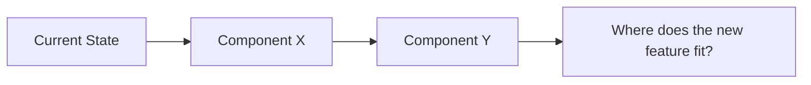
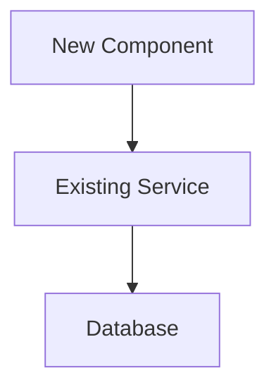

# BRAINSTORM Session

Collaborative design session for complex features. Structured flow with subagent dispatch, spec review, and Mermaid diagrams for visual aids.

## Entry Criteria
- Complexity: L or XL
- Vague or complex requirement
- No existing spec

## Process

### 1. Context Gathering

Dispatch governance-architect as subagent to collect context:

    You are the governance architect. Gather context for a brainstorm session.

    ## Task
    {user_task_description}

    ## Gather
    1. Read project structure (Glob for key directories)
    2. Read domain map from .sdlc/registry.yaml
    3. Read existing specs in docs/specs/ (are there related specs?)
    4. Read related code in affected domains
    5. Identify existing patterns, conventions, and constraints

    ## Output
    Provide a structured context summary:
    - Project structure overview
    - Affected domains and their current state
    - Related existing specs or implementations
    - Key constraints (tech stack, conventions, domain boundaries)
    - Open questions that need user input

### 2. Clarifying Questions

Architect asks user clarifying questions (one at a time, max 5):
- Each question should be specific and actionable
- Include context for why the question matters
- Where helpful, include a Mermaid diagram showing the current state:



HITL: user answers each question.

### 3. Approach Proposals

Architect proposes 2-3 design approaches:

For each approach:
- **Name:** descriptive label
- **Description:** 2-3 sentences explaining the approach
- **Architecture diagram** (Mermaid):



- **Pros:** bullet list
- **Cons:** bullet list
- **Affected domains:** which domains need changes
- **Estimated effort:** S/M/L per domain
- **Risk assessment:** what could go wrong

Present comparison as a structured table in terminal.

HITL: user selects approach (or requests modifications).

### 4. Spec Drafting

Architect drafts design spec based on selected approach:

    # Design Spec: {TASK-ID} — {title}

    ## Problem Statement
    {what problem are we solving and why}

    ## Selected Approach
    {approach name}: {description}

    ### Rationale
    {why this approach was chosen over alternatives}

    ## Architecture

    ```mermaid
    {architecture diagram}
    ```

    ## Domain Boundaries
    - {domain}: {what changes in this domain}
    - {domain}: {what changes in this domain}

    ## Data Model Changes
    {if any — new tables, modified schemas, migrations}

    ## API Contracts
    {if any — new endpoints, modified contracts, facade changes}

    ## Acceptance Criteria
    - [ ] {criterion 1}
    - [ ] {criterion 2}
    - [ ] {criterion N}

    ## Risk Assessment
    - {risk 1}: {mitigation}
    - {risk 2}: {mitigation}

    ## Anti-Patterns to Avoid
    {generated based on affected domains and task type}

    ### Architecture
    - Do NOT create circular dependencies between domains
    - Do NOT add shared mutable state outside a domain facade
    - Do NOT bypass the facade pattern for "quick" fixes

    ### Data Model
    - Do NOT add nullable foreign keys "to be filled later"
    - Do NOT store derived data that can be computed

    ### API Design
    - Do NOT create endpoints that return unbounded lists
    - Do NOT mix mutation and query in the same endpoint

Save to: `docs/specs/{TASK-ID}-{slug}.md`

### 5. Spec Review (subagent)

Dispatch a fresh subagent to review the spec:

    You are a spec reviewer. Review this design spec for completeness and feasibility.

    Spec: {spec_content}

    Check:
    1. Is the problem statement clear and specific?
    2. Are acceptance criteria testable and complete?
    3. Are domain boundaries clearly defined (which domain owns what)?
    4. Are data model changes backward-compatible (or is migration planned)?
    5. Are API contracts complete (request/response schemas)?
    6. Are risks realistic and mitigations actionable?
    7. Are anti-patterns relevant to this specific task?

    Report: PASS | NEEDS_REVISION (list specific issues)

If NEEDS_REVISION: architect revises. Max 2 review rounds.

### 6. User Approval

HITL: user approves spec (or requests changes).
- On approval: write SessionHandoff with specPath
- Chain to PLAN

## Participants
- governance-architect (mandatory, dispatched as subagent)
- Relevant domain developers (on-demand, for domain expertise)
- ux-designer (if UI feature)
- product-analyst (for L/XL features)
- Relevant SMEs (on-demand consultation)

## HITL
Heavy — questions, approach selection, spec approval.

## Visualization
v2.0 uses Mermaid diagrams in terminal (rendered by Claude Code's markdown support). Visual brainstorm server with Express deferred to v2.1.

## Output
- Design spec document (saved to docs/specs/)
- Spec path stored in handoff artifacts
- **Chains to PLAN** (orchestrator handles transition)
